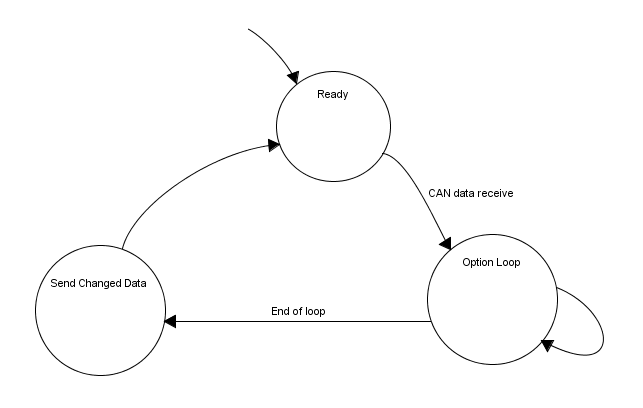
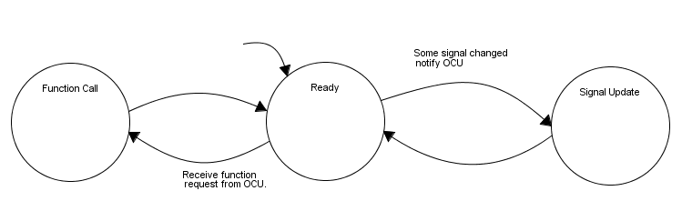
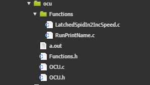

\newpage


#Requirements
We have established seven requirements divided into two categories. SHALL
requirements and SHOULD requirements. SHALL requirements must be implemented
during our thesis.

##SHALL requirements
(@) The core functionality shall be conserved without a decrease in functionality.
(@canprot) Establish an interface to use over the CAN protocol.
(@) At least one of the existing options shall be intact and work as intended -
as a proof of concept. This requires (@canprot).
(@) Adding new or modifying current options shall require no alteration of the MCU.


##SHOULD requirements
(@) Implement CAN bus functionality in order to validate the system. Could be
through CANalyzer or on a fork lift truck.
(@codegen) C code generating scripts (preferably
Python^[This is the scripting language used in The company's projects]) to use
when adding new options.
(@) GUI^[Graphical User Interface] for creating new options. Requires (@codegen).

\newpage <!-- PAGE BREAK  -->

#Model
In this section we will present and describe the initial system model.

##OCU Overview


###Ready
In this state the OCU will wait for signal messages from the MCU. This is the
default state, as the OCU always will be able to recieve updated signal data
from the interrupt driven CAN bus.

###Option Loop
Receive CAN data and update the internal table of signals.

The `runOptions()` loops through all options executing their corresponding function.
This means that every option will run its function regardless of if the signals,
that each option is dependent of, has changed or not.

###Send Changed Data
During the option loop the CAN send buffer will be filled with function calls
for the MCU. The buffer will have a max capacity and funtion as a queue with a
packet counter. The standard CAN protocol will be used, meaning that every 20 ms
packets in the buffer will be transmitted to the MCU.

Only the option packets which data differs from the last time they were sent
will be transmitted. This saves heavily on bandwidth utilization, which might be
a bottleneck in our application.


<!--\pagebreak <!--  PAGE BREAK  -->


##MCU Overview


###Ready
The _ready state_ is an extension of the MCU's main loop. The existing
functionality of the loop polls the underlying hardware for events, such as
pressed buttons but also polls the SEUs^[Spider Expansion Unit - black boxes
with I/O functionality] for similar changes. This is executed once every
iteration of the main program loop. As all this data _is_ gathered each loop.

###Function Call
When the OCU requests a function to be called, the MCU looks up the asked
function in its _function dictionary_. The appropriate function will run with
the parameters supplied by the OCU. Only functions made available can be called.

###Signal Update
The MCU reads the current hardware state, which we call _signals_, once every
loop iteration (i.e once each 20 ms). The MCU keeps track of the old state of
each of these signals. The OCU will be notified a signal changes.

A signal could be, for example, the state of a button or the current speed.

\newpage <!--  PAGE BREAK  -->

#Design specification
Here we will explain the system details in depth.

##OCU
The internal storage of options will be dealt with in an object oriented manner,
this in order to keep the structure as organized as possible. This will also
aid in the event of further development as the structure can be extended without
the need to rewrite all of the existing code. The code only has to be extended
in the same way the object is.

Suggestion on the `Options` object, which will be represented in an `array` on
the OCU.

```c
typedef struct
{
	funPtr run;		// Pointer to option function
	UByte arg[4];   // Each option algorithm utilize up to 4 arguments
	tByteWord stat;
} Option;
```

The main program of the OCU will consist of a basic loop to control the flow of
operations:

```c
void loop()
{
    convertSignalBufferToSignalArray(); // Receive CAN-Data and update signals
                                        // stored in the signal library
    runOptions();                       // Fresh data, re-run all the option
                                        // unique operations
}
```

In the function, `run()`, the conditions for every option is specified.
The option uses signals stored globally in the `signal_array` to calculate the
conditions. The `signal_array` is updated frequently by the MCU at the event of
a change in the signal values. At the event of a modification of any sort when
`runOptions` loops through all active option operations, a function call entry
is added to the CAN buffer to be sent to the MCU at the end of the loop routine.

How `runOptions` might work:

```c
void runOptions(void)
{
    // Before running the options, reset the speed restrictions if any
    resetMaxOptionSpeed();

    UByte OptionFunction;
    for (OptionFunction = 0; OptionFunction < NUMBER_OF_OPTIONS; OptionFunction++) {
        if (OptionArray[OptionFunction].run != 0) {
            OptionArray[OptionFunction].run();
        }
    }
}
```


\newpage <!--  PAGE BREAK  -->




Each function stored in the `OptionArray` will be defined in individual files in
a separate directory and will be declared in the header file _Functions.h_. This
will create a hierarchy easy to expand since the development of new options will
be file oriented. This will also help if we were to utilize script based
implementation of new options which is desired if a GUI^[Graphical User Interface]
layer is to be placed on top of the software.

The MCU will implement a new _API_, which allows the OCU to send function calls
over the CAN bus. The new interface is composed of `system`, `function`,
`module` and `value`.

`System` is used to divide the system into smaller sub systems in which
`function` can correspond to some function. The `function` indentifier will be
mapped to a function on the MCU.

The `changed` status flag is only used internally and is not sent over the CAN bus.
It is used to identify changed packets to not flood the CAN bus. The amount of
arguments needed is desired to be one or two, thus two function calls can fit into
one CAN data packet (8 Bytes). <!-- TODO: Kan behöva ses över om vi behöver fler än 2 argument-->

The CAN buffer packet entry `struct`:
```c
typedef struct {
	UByte system;   // Sub system identifier
	UByte function; // The function identifier, maps to a function on the MCU
	UByte arg1;     // Argument 1 for function
	UByte arg2;     // Argument 2 for function

	Bool changed;   // Only transmit changed function call to reduce CAN traffic
} OptionPacket;
```

The `AddRequestToCanBuffer` routine is used globally when functions have to add a
new entry to the CAN transmit buffer. E.g. the routine may be called several times from
functions in the `runOptions` routine. The buffer is the same size as available
functions to call on the MCU side, although only changed (or active) calls is
actually transmitted.

```c
void AddRequestToCanBuffer(UByte Sys, UByte Function, UByte arg1, UByte arg2)
{
    //Check old values against new to identify the changed status

    // Assign new values
    option_buffer[option_buffer_counter].sys      = Sys;
    option_buffer[option_buffer_counter].function = Function;
    option_buffer[option_buffer_counter].arg1     = arg1;
    option_buffer[option_buffer_counter].arg2     = arg2;

}
```

##MCU
The MCU Updates the signal_array on the OCU if any changes are made to the controll
signals on the system. `setSignalPacket`

```c
void setSignalPacket(SignalPacket* sig, UByte type, void* data)
{
    if (sig == NULL)
    {
        printf("setSignalPacket: Is null\n");
        return; // Null pointer - let's deploy parachute
    }

    switch (type)
    {
        case tUByte:
            if (sig->value.ub != *((UByte*)data))
            {
                sig->value.ub = *((UByte*)data);
                sig->changed = TRUE;
            }
        break;

        case tSByte:
            if (sig->value.sb != *((SByte*)data))
            {
                sig->value.sb = *((SByte*)data);
                sig->changed = TRUE;
            }
        break;

        case tUWord:
            if (sig->value.uw != *((UWord*)data))
            {
                sig->value.uw = *((UWord*)data);
                sig->changed = TRUE;
            }
        break;

        case tSWord:
            if (sig->value.sw != *((SWord*)data))
            {
                sig->value.ub = *((SWord*)data);
                sig->changed = TRUE;
            }
        break;

        case tBool:
            if (sig->value.ub != *((Bool*)data))
            {
                sig->value.ub = *((Bool*)data);
                sig->changed = TRUE;
            }
        break;
    }

    sig->type = type;
}
```

tar emot funktionsanrop
