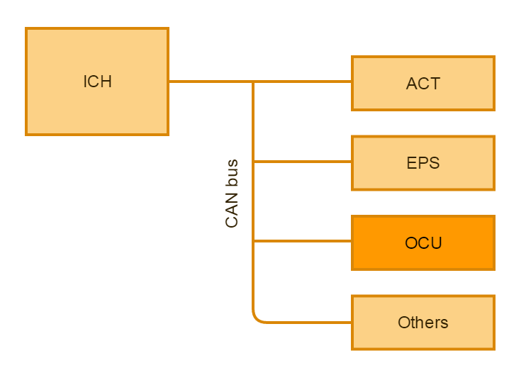

\newpage

<!-- http://www.ida.liu.se/edu/ugrad/thesis/instructions/Exjobb_anvisning_150313.pdf -->

<!-- TODO LIST:

-Figurförteckning (efter inehållsförteckning)
-Ordlista

-->
#Revisions

\vspace*{6\baselineskip}

| Version | Date       | Sign off      | Change note                           |
|---------|------------|---------------|---------------------------------------|
| 0.1     | 2015-02-23 | Robin, Niklas | First draft                           |

\newpage

<!-- Dela upp i ett stycke eller två -->
#Abstract
Unique customizations (options) of a fork lift trucks features are often
requested by customers. When new options is created or present options have 
to be modified in the main software the complexity increases, the firmware 
revision pool gets large and with the increasing code size the memory limit is 
threatened. This affects the software development since the frequent modification
of the option handler software is very resource consuming. Therefore it is 
desirable to have a highly modular system for the option handler to reduce the 
development process. Although the market value of this improvement is negligible
the possible long term savings is the desirable effect. The purpose of this 
thesis is to explore the possibility of migrating the option handling software
to a dedicated hardware module. This will help the development process by
increasing the modularity of the system architecture and thus reducing the 
development scope. Methods for model based development will be utilized to 
explore ways to efficiently speed up the software development process. The terms
of inclusion and the tools to accomplish this option handler is analyzed. 
A system model of the resulting approach will be designed and a prototype will 
be developed to validate the result.

#Introduction
We have conducted our thesis work at a big fork lift manufacturer located in
Östergötland as a part of our Bachelor degree in Computer Science. 
In this report the fork lift manufacturer will be called "The company".

##Motivation
A large quantity of the sold fork lifts are equipped with non-standard options
requested by the customer. An option might be anything ranging from turn 
indicators or speed constraints within a certain area to an advanced hydraulic
sequence with height, weight and speed restrictions.

These options are all implemented in the firmware that controls the truck. 
Currently, The company has no way to decouple the option implementation from the
main firmware. This means pollution of the source code tree as separate branches
has to be created for each customer specific option. This also means that there 
are multiple variants of the same version of program code that needs to be 
maintained.

##Purpose
In order to satisfy the increasing customer demand of new features (options),
The company needs a faster, more reliable and testable way to develop them.
Currently, options are added to the main firmware. 

This thesis aims to decouple the options implementation from the main
firmware and dedicate a separate unit to handle the options in order to speed up
development of new features, and decrease the number of potential bugs in the
main firmware. By doing this we achieve a more modular system. 
<!-- Här skriver vi att vi ska lägga till en extern enhet, kanske bör vi använda
detta som röd tråd genom hela rapporten. Alltså att vi helt struntar i att vi 
hade planer på att lösa det i befintlig MCU -->

##Problem
<!-- Två till fyra specifika frågor som är lätt att resonera kring -->
 - What needs to be taken in consideration when designing the options controller?
 - How is the CAN bus affected if additional controllers are added as it runs at 
   125 kbit per second.
 - Do we need to make modifications on the current CAN-bus communication protocol?
 - How do we validate the results, what tools do we use?

##Delimitations
The time will not be sufficient to develop a full scale version of the options
handling. With respect to that, we have chosen to spend most of the time
developing a working architecture, and a prototype. The prototype will be
written in such way that it should be easy to extend with new features.

The fundamental part of this thesis is the development of an architecture
as general as possible. It is therefore not vital that we implement all the
existing options, as long as the architecture can be deemed good enough to
handle them. This will be tested by implementing a few option that utilizes all
of the different part of the truck; hydraulics, drive, steer and display.

Further, one possible delimitation might be to hand off the MCU side of the
development to The company. This option, however, depends on how much time
they can spare. This delimitation is only applicable if we decide to put the 
options handling in an external chip.

If we implement the option handling in external hardware, the communication will
be over the CAN bus. This means that the protocol must be implemented in the
prototype. The results will be validated with a HIL (Hardware In the Loop)
system or with a truck.

<!--
Här beskrivs kortfattat de viktigaste avgränsningar som
medvetet gjorts. Det kan till exempel gälla att man fokuserat
arbetet på en viss tillämpningsdomän eller målgrupp. I
normalfallet behöver avgränsningarna inte motiveras.
-->

#Theory
<!-- BESKRIV CAN-PROTOKOLLET -->
The truck is divided in different function domains, controlled by different 
controllers; speed, hydraulics, steering and others.

All of these domains are controlled by the ICH which delegates commands over the
CAN bus. Some controllers, such as the SSU^[Shock Sensor Unit] tells the ICH when 
something is wrong. The ICH then has to take action.

This means that when developing the options controller, we still have to manage
critical functions in the ICH. It is not safe to rely on an (in this context) 
_external_ device controlling this. The ICH must have full an non-overrideable 
mode, a fail safe mode.

The option controller will therefore only ask the ICH to execute tasks. The ICH
will always have the last word over the action being asked to execute. 

<!-- Vet inte vart vi ska ha detta stycke - lite av det är egentligen redan skrivet -->
Today, The company handles a big quantity of customer specific options
on their fork lifts. The options are all being built in into the main controller
(MCU) of the truck. This leads to problems:

 - Developing the options requires a lot of resources, this because it began as
   a "one-off job".
 - Because all of the features exists in the main firmware, the code becomes
   very complex and hard to follow. Many of the features are also inactivated
   for most of the customers.
 - Many options have different parameters for different customers and trucks.
 - The available code memory will soon be filled. Adding additional code will
   require a larger on chip memory.
 - It is not possible to easily handle over the development of customer options
   to a another department, as it requires vast knowledge of the firmware.

The company is looking for an options handling solution which allows the
functionality to be moved from the MCU to a separate controller.

We will work out a solution where the options handling will allow development of
functionality, independent of the main firmware, in a more modular fashion. This
will allow parameter based configuration without the need of rewriting code. It
is important that all existing options are handled properly. This will imply
a reduction in time needed to develop new features.

A graphical interface is desired in order to simplify the administration of
options without the need of deep programming knowledge. A _PLC representation_
would give the user a good overview of active options and also the possibility
to customize parameters. It is also important that the options handling are
secure in a way that ensures that no unauthorized person can tamper with it.

Currently there is no significant market value in the options handling it self,
but in the long term there will be. Both in time savings as well as in product 
quality. This will give The company a better foundation to decide on the
possibility to include this in the control units of the trucks.

#Method
<!-- TODO Lista för Method

-->

During the thesis work, we utilized an iterative software development model.
We started out with the given hardware (named MCU2B) which, compared to the ICH,
is very powerfull. The hardware also contains various I/O, some capable of
driving high currents. 

<!-- Jag kladdar på lite, vi får bryta in det i rubriker senare -->
First, we started with the classic "Hello world!", by making a LED blink. From
there, we began removing unneeded code and started creating a foundation for the
options to build on. We quickly realized we needed a way to communicate with the
MCU2B. The company have CAN bus interfaces with competent software, but they cost
a lot, and there is a limited access to them, as they are used by other developers.
This lead to us creating our own CAN bus software.

For hardware, we used EMS CPC-USB, which sells for less than €200. Thanks to 
Volkswagen Research^[https://www.kernel.org/doc/Documentation/networking/can.txt],
the Linux kernel has support for CAN. This made it possible
for us to build a relatively complete test bench simulating the truck with a 
small Python application.

With the test bench, we were able to build a prototype working good enough to
function in a live truck with almost no modifications. 

##Feasibility study
To implement an external option handler, the embedded software design had to be studied 
in order to establish the new system prototype. The vital parts of the current 
option handler were to be indentified and the expandability of the CAN interface
explored. Tools for implementing the prototype were identified and
this phase resulted in a complete system model. Here we present the initial 
analysis of the current system.

The company has an options handler where the options runs tightly coupled in
the main loop. The options are setup with a parameter table, one row with
multiple columns per option. This table has to be modified for each truck as
some parameters differs between different truck models. 

This makes it _dangerous_ and non-trivial to implement new options as a bug in
one option might cause the truck to fail. The truck does implement fail detection
in the kernel, and there is also a watchdog which triggers if the code stops
responding. However, the code in the unit responsible of controlling the truck
should ideally be modified as little as possible. Having all of the options
integrated in the main firmware makes it harder to test the functionality.

A more testable rendition of this would be having the options in a separate
hardware unit and making it listen to data existing on the CAN bus. This way,
testing is done by giving it input A and verifying that output B comes out.
There is no need to sprinkle in debug blocks if you can test the output from the
code.

The current option handler as it sits has direct access to alot of the internal 
hardware- and software functionality of the ICH. Thus the individual options has 
alot of freedom towards modifying the truck functionality. If we are to migrate the 
option handler to an external unit it is therefore important to keep the current 
level of access in the new system. 

Theoretically since the functionality available inside the ICH had to be accessed 
from outside the ICH we had to add additional CAN communications to access these
from the new option handler, connected to the bus. Some of the operations available 
internally on the ICH can be recovered from the raw CAN traffic already present on 
the bus.

The main challenge of the project was to find the correct balance and identifying
the vital parts for the option handler to operate outside the ICH. The CAN 
communication we had to add came with the price of risking to flood the bus.
This is not desired since the overall response of the system would decrese.
We only considered adding traffic if it was absolute necessary. The signals 
already present at the CAN-bus was prioritized and utilized to the full extent. 
These signals could simply be sniffed by listeners without adding traffic to the bus. 

The CAN communication protocol used in the forklifts are statically time based, 
which means that no dynamical transmit and receive interupt routines are allowed.
The kernel frequency ticks each 1.25 ms and counts to 20 ms to instance the main 
software interrupt routine. The main software interrupt routine includes both the 
main software and the communication routines. The majority of system modules
consists of a pre-application, a run-application and a post-application to statically direct the flow of operations. By this softwarearchitecture the overlap of several system modules can be predefined to easier 
prevent timing issues. The memory is statically handled aswell so no dynamicaly 
allocated momory is allowed within the system, the momory is pre-loaded and this
setup works well with this type of embedded system.

The pre-application often includes handling of newly received CAN signals. E.g.
scaling of raw values etc. The run-application is the main software routine for 
the module where all the operations is specified. The post-application is last step
before leaving the module's software routine. In this step typically instances the 
CAN transmission routine.

TODO:Explain CAN protocol 8 bytes, dlc, id.. etc

##Worst case CAN latency
Most of the CAN data objects, all PDOs^[Process Data Object], are sent with a 20 ms interval.

This means that the worst case roundtrip is 60 ms. This is because of different 
PDOs can have different priority, depending on the receive address. 

If the CAN bus becomes temporary congested due to previous transmit error or
other reason, the PDO queue of each unit tries to re-send. When this happens, 
packet latency will occur.

This is something you would have to consider when implementing time sensitive 
operations, such as emergency stop. The system has been tested by The company 
and remains very stable even at periods of bus loads far above 100 %^[A packet queue higher than the possible packet rate].

<!-- TODO System model here -->

Together with our mentor we identified the vital signals and specified the new 
CAN interface for the OCU. The OCU adds a total of three (3) PDOs when configured to full truck interaction. The address of the OCU is 0x1B (decimal 27). 

The OCU only requires one PDO to be sent from the ICH. This PDO includes signals
required by the OCU to operate. This PDO includes option button bit field among others. As an example, the option buttons are available to read as hardware
functionality on the ICH. There are a total of six option buttons on the handle 
and therefore fits as a bitfield inside one byte. This is perfect since we can 
dedicate one byte in the PDO for all the button status where a high bit represent a button at a index beeing pressed. This is the only receive package on the OCU, called PDO RX1.

In order to restrict or request drive/hydraulic/steer functions from the OCU to 
the ICH one additional PDO is added. This PDO is for the more operational demands
wich the OCU needs to be able to instruct the ICH. These operation primitives are
frequently used by the individual options. As an example a option may want to restrict
the drive speed. This PDO is the first of two transmit PDOs needed by the OCU, 
called PDO tx1.

A third PDO is required in order to control the display and the surrounding LEDs
located in the fork lift handle. The reason for needing a whole PDO just for the 
display is simply that the four didgit display needs a set of four bytes for 
receiving characters (1 `char` = 1 byte). This PDO is the second transmit PDO 
called PDO tx2.

<!-- 
TODO: Insert PDO interface table here.
model: explain software flow
-->

##Implementation of prototype
The system model gave way for the iterative implementation process of the prototype.
The implementation started with very simple sub-prototypes mostly aimed towards
testing our understanding of the CAN-bus. The first fundamental prototype forked 
into two systems where the OCU was implemented to the extent possible in a standalone
state. To complement the standalone OCU, a debug tool were developed to represent
all the subsystems not avilable at this stage of the implementation process.
The final prototype implementation was a real truck application where all the 
compromises, introduced by the debug tool, were eliminated.

The purpose of the first prototype was to demonstrate the system model achieved 
in the feasibility study. We were introduced to the MCU2B which was perfect for
the purpose of representing the external OCU. Together with the MCU2B we would 
have the standard ICH hardware to represent the original system. These hardware 
modules would link together using a CAN-bus fork harness. Additional hardware 
needed to establish the prototype included a 24 volt power supply and two 
CPC-USB; one for debugging of the CAN-bus and one for firmware download.

Test option 1, 2 and 3^[See Appendix A] were specified before implementation
of prototype 0.1 started. These were of great assistance since the test options
worked as milestones when implementing the OCU prototype and also help us locate 
flaws early in the implementation process. These three options would also be used
to validate the system at the half-time presentation of the prototype.

To sum up, the neccessary esentials to start the actual implementation included 
the following: A complete system model including CAN PDO interface and software 
flow, The rigg was established and a few test options for validation were specified.

BILD på mcu2b?

First we modified the ICH and OCU software to run benchbuild `#define BENCHBUILD TRUE`.
This mode allows us to run the ICH standalone without the need of the several
external modules e.g. EPS or ACT modules wich are required by the ICH if 
running non-benchbuild. If external modules are missing the ICH goes into 
aserted mode from waiting for the modules to respond and does not initialize 
other modules or any operations what so ever.

TODO: describe actual coding

OCU

Python Debug

##Evaluation
Evaluation occured somewhat successivley inline with the several sub-prototypes
were finished to be able to move on to the next step. Several tools to validate 
the system, identified in the study phase, were utilized. The main evaluation strategy 
were to involve test-options^[See Appendix A] <!-- FIND APPENDIX NUMBER! -->
to easier identify limitations of the prototype. The grand finale of the evaluation
process had all the test-options active on a real truck. Results were mostly 
based on this phase.

<!-- Resultat Samma underrubriker som metod för röd tråd -->
#Result
<!-- TODO Lista för Resultat

-->

##Feasibility study

##Implementation of prototype

##Evaluation

#Discussion
<!-- TODO Lista för Discussion

-->

##Result

##Method

##Future work

#Conclusions

\newpage

#Citations

\newpage

#Vocabulary

| Word             | Meaning                                                    |
|------------------|------------------------------------------------------------|
| ACT              | Motor controller                                           |
| EPS              | Electric servo controller                                  |
| ICH              | The master control unit controlling all units of the truck |
| SEU              | Spider expansion unit, hardware with I/O                   |
| OCU              | "Spider version 2.0", I/O and beefier CPU                  |
| MCU2B            | The name of the hardware we implemented our OCU on         |

\newpage

<!-- använd mall från IDA för appendix format.
     Interview appendix -->
#Appendix A, test options
Here are the, from The company given, options we implemented. These options
lets us control a big part of the truck functions; speed, steer and hydraulics.

##Turn lights
They should work like in a car. A press on option button 1 will make an output
on the OCU toggle a 1 hz, which will correspond to left turn light. When the
steer angle has passed a predefined value to the left, and then returned to 
another predefined value smaller than the first, the light should turn of. The
same thing should happend when using option button 6, but with a right turn.

##Lift height restriction
When lifting more than 1000 kg, it should not be possible to lift the forks above
a predefined height. When pressing option button 5, an override should be possible
allowing the forks to go higher. There should also be a second predefined height
which you should not be able to lift above, no mather regardless of fork load.
This restriction should also be possible to bypass when pressing option button 5.

##Speed and steer angle restriction
If the truck load is above 2000 kg, the maximum speed should decrease linear in
the range 6 to 4 km/h. When loaded 2000 kg, the max speed is 6 km/h and max 4 km/h
at a load of 2500 kg or more. Similar, the maximum steer angle should be restricted
linear from 90$^{\circ}$ to 70$^{\circ}$ in the same load intervall; 90$^{\circ}$ 
at 2000 kg and 70$^{\circ}$ at 2500 kg or more.

##Horn
Pressing the horn button should sound the horn and display "horn" on the display.

\newpage

#Appendix B

