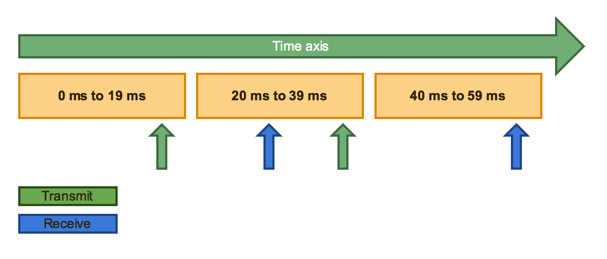
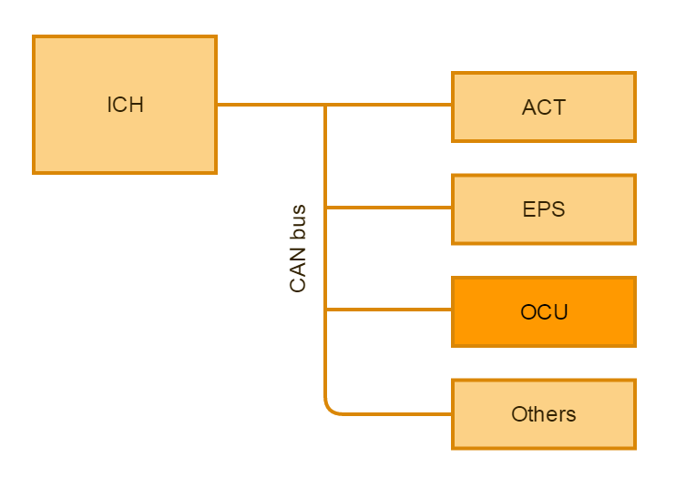
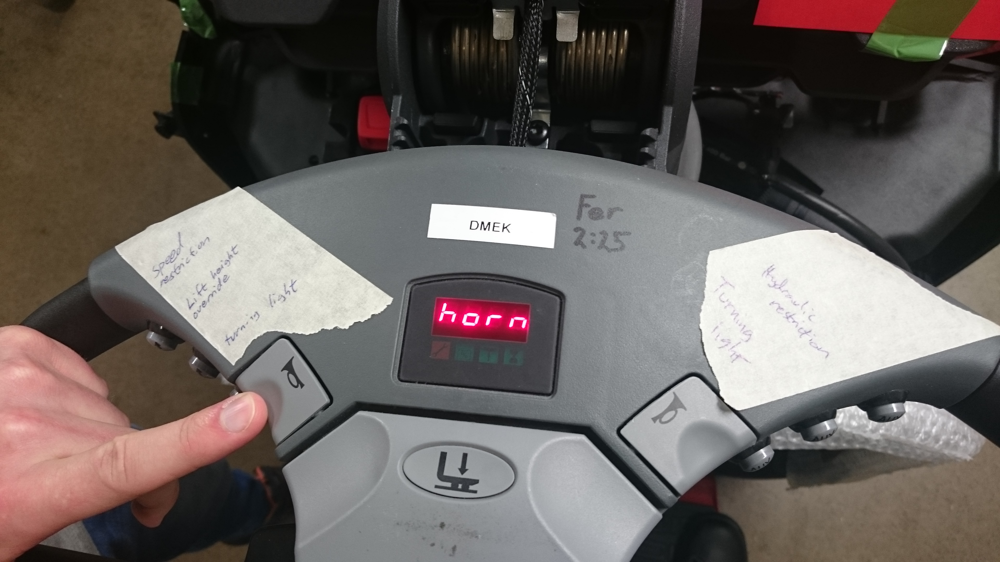
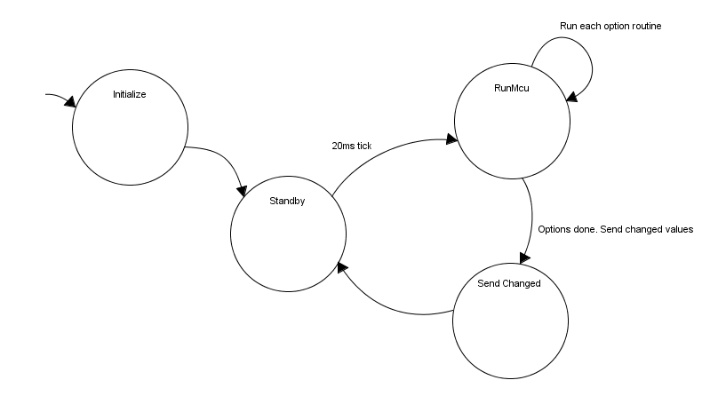
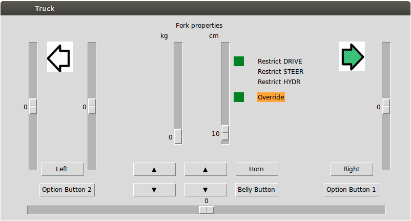
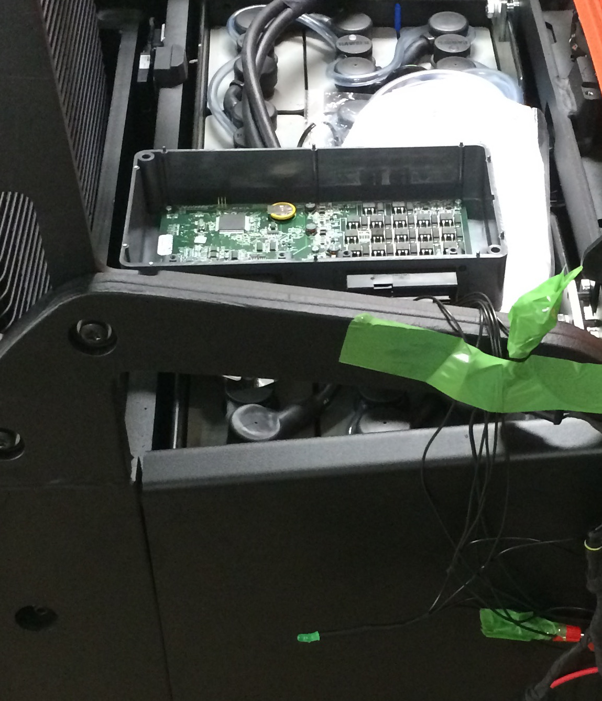
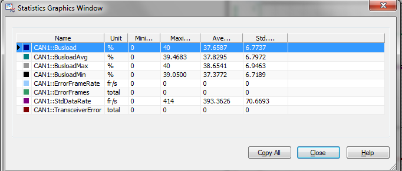
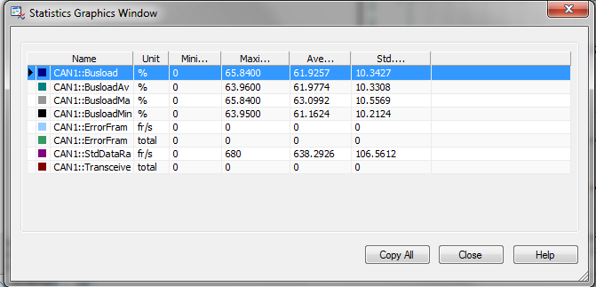

\newpage


<!-- http://www.ida.liu.se/edu/ugrad/thesis/instructions/Exjobb_anvisning_150313.pdf -->

<!-- TODO LIST:

- Försättsblad x2

-->
#Revisions


\vspace*{6\baselineskip}


| Version | Date       | Sign off      | Change note                         |
|---------|------------|---------------|-------------------------------------|
| 0.1     | 2015-06-18 | Robin, Niklas | First draft                         |
| 0.2     | 2015-07-13 | Robin, Niklas | Second draft                        |
| 1.0     | 2015-08-21 | Robin, Niklas | First edition                       |


\newpage

#Vocabulary

| Word             | Meaning                                                  |
|------------------|----------------------------------------------------------|
| ACT              | Motor controller                                         |
| EPS              | Electric servo controller                                |
| ICH              | The control unit controlling all units of the truck      |
| SEU              | Spider expansion unit, hardware with I/O                 |
| OCU              | Our prototype, I/O and beefier CPU                       |
| MCU2B            | The name of the hardware we implemented our OCU on       |
| GUI              | Grapical user interface                                  |
| PLC              | Programmable logic controller                            |
| SSU              | Shock Sensor Unit                                        |
| BCU              | Battery Charger Unit                                     |
| ICH              | Integrated Control Handle                                |

\newpage

#Abstract
Unique customizations (options) of features in forklifts are often requested by customers. When new options are created or existing options have to be modified in the main software the complexity increases, the firmware revision pool gets large and with the increasing code size the memory limit is threatened. 

This affects the software development since the frequent modification of the option handler software is very resource consuming. Therefore it is desirable to have a highly modular system for the option handler to reduce the development process. Although the market value of this improvement is negligible the possible long term savings is the desirable effect. 

The purpose of this thesis is to explore the possibility of migrating the option handling software to a dedicated hardware module. This will help the development process by increasing the modularity of the system architecture and thus reducing the development scope. The terms of inclusion and the tools to accomplish this option handler is analyzed. A system model of the resulting approach will be designed and a prototype will be developed to validate the result.

\newpage

#Preamble
We want to take this opportunity to thank the Company and everyone involved for the assistance within this project. Especially we want to thank our mentor Michael Strand and our supervisor Patrick Blomqvist. We also want to thank our examiner Unmesh Bordoloi. 

 \newpage

#1 Introduction
We have conducted our thesis work at a big forklift manufacturer located in Sweden as a part of our Bachelor degree in Computer Science. In this report the forklift manufacturer will be called the "Company".

##1.1 Motivation
A large quantity of the sold forklifts is equipped with non-standard options requested by the customer. An option might be anything ranging from turn indicators to an advanced hydraulic sequence with height, weight and speed restrictions.

These options are all implemented in the firmware that controls the truck. Currently, the Company has no way to decouple the option implementation from the main firmware. This means pollution of the source code tree as separate branches has to be created for each customer specific option. This also means that there are multiple variants of the same version of program code that needs to be maintained.

##1.2 Purpose
In order to satisfy the increasing customer demand of new features (options), the Company needs a faster, more reliable and testable way to develop them. Currently, options are added to the main firmware. 

This thesis aims to validate the vision of an external option handler. The option implementation will be decoupled from the main firmware and a dedicated unit for managing options separately will be added. The communication between units will be handled by a CAN (controller area network) bus. By doing this we will achieve a more modular system and this will speed up development of new features as well as decrease the number of potential bugs in the main firmware. 

##1.3 Problem
 
 - What needs to be taken in consideration when designing the options controller?
 - How is performance of the CAN bus affected, if additional controllers are added, with regards to bus-load and round-trip time?
 - Do we need to make modifications on the existing CAN-bus communication protocol?

 \newpage

##1.4 Delimitations
The time will not be sufficient to develop a full scale version of the options handling. With respect to that, we have chosen to spend most of the time developing a working architecture, and a prototype. The prototype will be designed in such way that it should be easy to extend with new features.

The fundamental part of this thesis is the development of an architecture as general as possible. It is therefore not vital that we implement all the existing options, as long as the architecture can be deemed good enough to handle them. This will be tested by implementing a few options that utilizes all of the different part of the truck; hydraulics, drive, steer and display.

Further, one possible delimitation might be to hand off the master side of the development to the Company. This option, however, depends on how much time they can spare. 

 \newpage

#2 Theory
In this chapter, we explain the theory needed to explain the method and result.

##2.1 The forklifts
The truck is divided in different function domains, controlled by different hardware. These domains are drive, steering, hydraulics and other miscellaneous peripherals. Among the latter we have the SSU^[Shock Sensor Unit] and BCU^[Battery Charger Unit], but it could also be internet connectivity or other sensors of any kind.

All of these domains are controlled by the ICH^[The Master module located in the forklift handle] (the master node) which delegates commands over the CAN bus. Units like the SSU sends messages to the ICH over the CAN bus when something is wrong. The ICH then has to take action: it can be reducing the speed to a halt or steer in a certain direction.

This means that when developing the options controller, we still have to take in to consideration that the ICH is the only unit able to take action upon request. It is not safe to rely on the external option unit if it is allowed to do this. The ICH must have a full non-overrideable fail safe mode.

The option controller will therefore only ask the ICH to execute tasks. The ICH will always have full control over the action being requested.

\newpage

##2.2 CAN
The CAN protocol utilized in the trucks is _CANopen_ (1) which has support for network management and device monitoring. Messages are being sent in frames where frame format is illustrated below:


The communication object identifier (COB-ID) consists of 11 bits of data, where the frame with the lowest ID-value has the highest priority. This means that in the case of bus collision, the packet with the highest priority wins. 

The RTR, or Remote Transmission Request, is not used by us, but it can be used to request data. Normally this is set to 0 as the data objects usually transmit.

The Data Length Code (DLC) tells the receiving end how many bytes of data to expect. The maximum bytes of data you can send in one frame are 8.

\newpage

###2.2.1 Communication function codes
In the CANopen protocol each CAN frame is mapped to a certain function code. The first four bits of the COB-ID represents the function code so that critical frames are automatically given higher priority. Multiple function codes are used; Network Management (NMT), Service Data Object (SDO), Process Data Object (PDO) and Emergency Object (EMCY). The more important objects are given a lower function code value and thus are prioritized during communication. In addition to the function code priority, the rest of the COB-ID is used to prioritize among the individual frames within the same function code.

**NMT:** The NMT function code is used to change device states. Our implementation does not use this function code. The states which may be requested are (hexadecimal address and _name_):

 - 0x01 _operational_
 - 0x02 _stopped_
 - 0x80 _pre-operational_
 - 0x81 _reset node_
 - 0x82 _reset communication_

**SDO:** The Service Data Object function code is used when a client needs to get or set a value on the server. A use case for this might be reading the driver profile from the ICH in order to compensate options to driver preferences. Our implementation does not use this function code.

**PDO:** This is the most used function code in the truck. There are multiple PDOs being sent to and from the ICH and other units. These objects are typically relatively time critical as they contain information ranging from drive speed to steer angle.

Our implementation builds fully on this function code.

**EMCY:** A device can send an error message on internal fatal error. They are sent with high priority which makes them usable as interrupts if the receive routine is adapted. Our implementation does not currently use this function code.

<!-- 
At present allow fixed number of identifier with some packing strategy 
 - why is this done?
 - how it was done
 - how to add more signals
-->
###2.2.2 Signal Handling
We label the data required to be sent over the CAN bus as signals. Each of these signals may take up one or more bytes. These signals are placed in a CAN frame (PDO) which may contain up to eight signals, each being one byte long. If the signals are longer than one byte, the frame will contain less than eight signals.

The firmware on the ICH and OCU is configured to have a 20 ms long application cycle. All frames that are transmitted over the CAN bus are queued to be sent once each application cycle. During these 20 ms, a CAN frame can be sent each 1 ms or 1.25 ms depending on host device (OCU and ICH respectively), this because of their respective CPU interrupt timers.

###2.2.3 Worst case CAN latency
The PDOs are sent with a 20 ms interval making the worst case round-trip 60 ms. As demonstrated in _figure 2_, if two nodes are suffering from latency, a PDO frame can be transmitted from node 1 late in the communication time window (0 ms to 19 ms). Node 2 will receive the frame and transmit the answer frame during the second time window (20 ms to 39 ms). The final answer might arrive late to node 1 at the last time window (40 ms to 59 ms) giving the absolute worst case delay (round-trip time) of 60 ms for the handshake. This is because different PDOs can have different priority, depending on the receive address. If the CAN bus becomes temporary congested due to previous transmit error or other reason, the PDO queue of each unit tries to re-send. When this happens, packet latency will occur. Packet latency occurs continuously when two units tries to send data at the same time and this latency is often negligible as it normally only lags behind for a couple of milliseconds.



This is something you would have to consider in a real-time system when implementing time sensitive  operations, such as emergency stop. The system has been tested by the Company and remains very stable even at periods of bus-loads far above 100 %^[A packet queue larger than the possible packet rate], even with our modifications.

As described in section 5 in Robert Davis' paper (4) all frames will meet their deadline in a optimistic worst case scenario although frames with lower priority will suffer from latency, due to blocking and interference^[See section 5, figure 8 in Robert Davis' paper (4)], more than others. Our CAN implementation has the deadline time window of 20 ms and this results in the worst case round-trip time of 60 ms by considering initial scheduling of frame, receiving frame and replying with a new frame as well as receiving the new reply frame as described in _figure 2_.    

\newpage

#3 Method
In this chapter, we describe the approach and how we concluded the results of this thesis.

##3.1 Feasibility study
We began by establishing the criteria for the options handling. This included asking our mentor how it was supposed to function, but also reading up on how the options are implemented currently.

First, we worked mostly without coding, discussing possible valid solutions and put them through theoretical dry-runs. By trying to get our thoughts on paper directly we managed to avoid failures. Continuously we asked questions as they came up.

Second, the embedded software design had to be studied in order to establish the new system model. The vital parts of the current option handler were to be identified and the expandability of the CAN interface explored. Tools for implementing the prototype were identified.

Before implementing the option control unit (OCU^[OCU: The name of our new external option handler, Option Control Unit]) prototype we designed a complete system model including details about hardware aspects, approximate software flow and CAN interface.

###3.1.1 Current system
The Company has an options handler where the options run tightly coupled in the main loop. The options are setup with a parameter table, one row with multiple columns per option. This table has to be modified for each truck as some parameters differs between different truck models. 

This makes it _dangerous_ and non-trivial to implement new options as a bug in one option might cause the truck to fail. The truck does implement fail detection in the kernel, and there is also a watchdog^[Hardware timer which restarts the system if the timer has not been restarted] which triggers if the code stops responding. However, the code in the unit responsible of controlling the truck should ideally be modified as little as possible. Having all of the options integrated in the main firmware makes it harder to test the functionality.

\newpage



The current option handler as it sits has direct access to a lot of the internal hardware- and software functionality of the ICH (the master node). Thus the individual options have a lot of freedom towards modifying the truck functionality. To migrate the option handler to an external unit the current level of access had to be kept in the new system. 

Theoretically since the functionality available inside the ICH has to be accessed from outside the ICH we had to add additional CAN communications to access these from the new option handler, connected to the bus. Some of the operations available internally on the ICH can be recovered from the raw CAN traffic already present on the bus; functions such as reading the current speed or steer angle.

The main challenge of the project was to find the correct balance and identifying the vital parts for the option handler to operate outside the ICH. The CAN communication we had to add came with the risk of flooding the bus. This is not desired since the overall response of the system would decrease. We only considered adding traffic if it was absolute necessary. The signals already present at the CAN-bus was prioritized and utilized to the full extent. These signals could simply be sniffed by _listeners_^[Software modules that listens to a specific unit on the CAN bus] without adding traffic to the bus. 

The kernel of the ICH ticks^[Generates interrupt in which kernel and application functions are called] every 1.25 ms. In the MCU2B, the kernel ticks once each 1.0 ms. In both cases the main application loop, including communication instancing, is called once each 20 ms. If the loop is not finished in that time, the truck will stop.

This is roughly how the interrupt routine for the kernel works. The code is simplified to reflect the gist.


```c
void runKernel(void)
{
   DisableInterrupts;
   
   handleCanTransmit(); // Send queued CAN messages

   EnableInterrupts;
   
   if (CurrentKernelTick == KERNEL_RUN_APPLICATION) {
      preApplication();   // Prepare various input/control status
      handleCanReceive(); // Make recieved messages available
      runApplication();   // Run application based on input (CAN/HW)
      postApplication();  // Set output based on runApplication()
      resetWatchdog();    // Reset watchdog timer
   }
}
```

The majority of system modules consist of a pre-application, a run-application and a post-application to statically direct the flow of operations. By this software architecture the overlap of several system modules can be predefined to easier prevent timing issues. The memory is statically handled. Dynamically allocated memory is not allowed within the system. This is standard practice when developing embedded systems.

The pre-application often includes handling of newly received CAN signals. E.g. scaling of raw values etc. The run-application is the main software routine for the module where all the operations are specified. The post-application is last step before leaving the module's software routine. This step typically calls the CAN transmission routine.

###3.1.2 PDO Interface
Together with our mentor we identified the vital signals and specified the new  CAN interface for the OCU. This was very challenging due to not wanting to flood the bus with too much traffic but still having access to as much utilities as possible. The OCU interface we agreed upon adds a total of three (3) PDO frames when configured to full truck interaction. The address of the OCU is 0x1B (decimal 27).

 \newpage

The OCU only requires one PDO to be sent from the ICH (the master node). This PDO includes signals required by the OCU to operate. This PDO includes option button bit field among others. As an example, the option buttons are available to read as hardware functionality on the ICH. There are a total of six option buttons on the handle and therefore fits as a bit field inside one byte. This is perfect because we can dedicate one byte in the PDO for all the buttons' status. This is the only receive object on the OCU, called PDORx1.



The OCU does receive other PDOs as well, but they are not addressed specifically to it. E.g. the ACT (the motor controller) addresses its data to the ICH, but the OCU has the possibility to read the same data from the bus. For this purpose, we have setup a way to relatively easy listen to PDOs not addressed to the OCU.

\begin{table}[H]
\centering
\begin{tabular}{llll}
\emph{Controller} & \emph{Folder} & \emph{Getter}     \\
\hline
ACT & sm\_act & \texttt{tCanMsg* get\_CanAct(int index)} \\
EPS & sm\_eps & \texttt{tCanMsg* get\_CanEps(int index)}  \\
Other & sm\_other & \texttt{tCanMsg* get\_CanOther(int index)} \\
\hline
\end{tabular}
\caption{Folder structure for CAN sniffers}
\end{table}

This method makes it relatively easy and clean to implement new listeners. The `tCanMsg* get_Can<xyz>(int index)` as seen in _table 3_, returns a pointer to the CAN message, which makes the received data available. The `index` is used to select from different PDOs sent by a controller. All core controllers send more than one PDO. The first PDO of the ACT is accessed this way:

```c
uint8_t example_data = get_CanAct(0)->Data[0];
```

**PDORx1:**
The PDORx1 is the most important PDO message that the ICH transmits to the OCU. This message gives the OCU the information that is internal to the ICH and non-existing on the CAN bus.

<!-- PDORx1 table -->
\begin{table}[H]
\centering
\begin{tabular}{llll}
\emph{Byte} & \emph{Variable} & \emph{Data type} & \emph{Unit}     \\
\hline
0..1 & BflyRamped\footref{bflynote}   & S16       & 100 \%/32508  \\
2    & AdLift\footref{adlift1note}    & S8        & 100 \%/127    \\
3    & AdLift\footref{adlift2note}    & S8        & 100 \%/127    \\
4    & Digital Button bitfield        & Bitfield  & -             \\
5    & Option Button bitfield         & Bitfield  & -             \\
\hline
\end{tabular}
\caption{PDORx1}
\end{table}

\footnotetext{\label{bflynote}{The value of the throttle}}
\addtocounter{footnote}{1}
\footnotetext{\label{adlift1note}{The value of the first analog lift control}}
\addtocounter{footnote}{1}
\footnotetext{\label{adlift2note}{The value of the second analog lift control}}
\addtocounter{footnote}{1}

<!-- End of PDORx1 table -->
In _table 4_ we show the content of the PDORx1 communication frame. The 8 bytes of data in the frame contains: the current state of the throttle, _Butterfly_, and the analog value of the forklift controls as well as the button bitfields. The handle has an array of buttons, some for controlling core functionality and some for options.

In _table 5_ the bits for all the buttons are displayed. Among the core buttons, there is the _horn_, the _Belly button_ which makes the truck brake and reverse if pressed, and two switches for hydraulic functions; _DiLift_ 1 and 2. They control the high lifting forks and the low lifting forks respectively.

<!-- PDORx1 bit fields -->
\begin{table}[H]
    \caption{Button bit fields}
    \begin{minipage}{.5\linewidth}
      \caption{Digital buttons}
      \vspace*{1\baselineskip}
      \centering
        \begin{tabular}{ll}
            \emph{Bit no} & \emph{Alias} \\
            \hline
            0      & DiLift2Up   \\
            1      & DiLift2Down \\
            2      & DiLift1Up   \\
            3      & DiLift2Down \\
            4      & Horn        \\
            5      & BellyButton \\
            \hline
        \end{tabular}
    \end{minipage}%
    \begin{minipage}{.5\linewidth}
      \centering
        \caption{Option buttons}
        \vspace*{1\baselineskip}
        \begin{tabular}{ll}
            \emph{Bit no} & \emph{Alias} \\
            \hline
            0      & Opt6  \\
            1      & Opt5  \\
            2      & Opt4  \\
            3      & Opt1  \\
            4      & Opt2  \\
            5      & Opt3  \\
            \hline
        \end{tabular}
    \end{minipage} 
\end{table}

Set bit indicates a button being pressed. Depending on implementation, a button can act as a switch which toggles on or off, or active high. Multiple buttons might be active at any time.

**PDOTx1:** As discussed earlier in section 3.1.2, the OCU control the ICH node. _Table 8_ displays the PDO of operations which the OCU can control most of the ICH with. Functionality can be requested or restricted. Also, combinations of operations can be sent. 

\begin{table}[H]
\centering
\begin{tabular}{llll}
\emph{Byte} & \emph{Variable} & \emph{Data type} & \emph{Unit}         \\
\hline
0 & Command\footref{cmdnote}       & Bitfield & 100 \%/32508           \\
1 & Drive Speed\footref{drivenote} & S8       & 100 \%/127             \\
2 & Drive Speed Change             & U8       & 100 \%/127             \\
3 & Hydraulic command\footref{reqdrivenote}   & S8  & -                \\
4 & Hydraulic function\footref{hydrnote} & Bitfield & -                \\
5..6 & Steer angle & S16 & ~1/182$^{\circ}$                            \\
\hline
\end{tabular}
\caption{Command}
\end{table}

\footnotetext{\label{cmdnote} A zero indicates no request/restriction}
\addtocounter{footnote}{1}

\footnotetext{\label{drivenote} Range -12.5 to +12.5 km/h. Sign determines direction. If value is zero, ICH controls speed change}
\addtocounter{footnote}{1}

\footnotetext{\label{reqdrivenote} Positive value corresponds to lowering. Hydraulic function must be set.}
\addtocounter{footnote}{1}

\footnotetext{\label{hydrnote} Only one hydraulic function can be active at any given time.}
\addtocounter{footnote}{1}

\begin{table}[H]
    \caption{Bitfields}
    \begin{minipage}[H]{.5\linewidth}
      \vspace*{1\baselineskip}
      \centering
      \begin{tabular}{ll}
            \emph{Bit no} & \emph{Alias} \\
            \hline
            0     & Request drive        \\
            1     & Restrict drive       \\
            2     & Request hydraulic    \\
            3     & Restrict hydraulic   \\
            4     & Request steering     \\
            5     & Restrict steering    \\
            6     & Request power        \\
            7     & Not used             \\ 
            \hline
      \end{tabular}
      \caption{Command}
    \end{minipage}%
    \begin{minipage}[H]{.5\linewidth}
        \vspace*{1\baselineskip}
        \centering
        \begin{tabular}{ll}
            \emph{Bit no} & \emph{Alias} \\
            \hline
            0      & 1\textsuperscript{st} function \\
            1      & 2\textsuperscript{nd} function \\
            2      & 3\textsuperscript{rd} function \\
            3      & 4\textsuperscript{th} function \\
            4      & 5\textsuperscript{th} function \\
            5      & 6\textsuperscript{th} function \\
            6      & 7\textsuperscript{th} function \\
            7      & 8\textsuperscript{th} function \\
            \hline
        \end{tabular}
        \caption{Hydraulic function}
    \end{minipage} 
\end{table}

_Table 9_ shows the bitfield of command bit (_table 10_) and the hydraulic selector bit (_table 11_). It is up to the implementation in the ICH to determine if, for example, multiple functions can be requested simultaneous: speed and steer angle can be relevant to restrict at the same time. Some function combinations are moot; request and restrict uses the same field for the speed.

Request power is not required on any of our prototypes. Due to wiring and other circumstances, we did not implement this.

**PDOTx2:**

\begin{table}[H]
\centering
\begin{tabular}{llll}
\emph{Byte} & \emph{Variable} & \emph{Data type} & \emph{Unit}     \\
\hline
0  & Display 1\footref{dispnote} & U8          & -  \\
1  & Display 2                   & U8          & -  \\
2  & Display 3                   & U8          & -  \\
3  & Display 4                   & U8          & -  \\
4  & LED indicators bitfield     & Bitfield    & -  \\
\hline
\end{tabular}
\caption{Display and LED data}
\end{table}

\footnotetext{\label{dispnote} Display 1 is the leftmost digit. When set to 0, ICH controls the display.}
\addtocounter{footnote}{1}

The process data object in _table 12_ is only used to control the display and it's surrounding LEDs. If the first byte is set to 0, the display will be handled by the ICH. The first four bytes are actual ascii values of the four digits on the display. The fifth byte is the bitfield for activating the led-indicators. In _table 13_ the indicator choice is displayed. 

\begin{table}[H]
    \centering
    \begin{tabular}{ll}
        \emph{Bit no} & \emph{Alias} \\
        \hline
        0 &      Time indicator     \\
        1 &      Pot indicator      \\
        2 &      Battery indicator  \\
        3 &      Tool indicator     \\
        \hline
    \end{tabular}
    \caption{LED indicator bitfield}
\end{table}

\newpage
 

##3.2 Implementation of prototype
Once we fixed the system model, we continued with an iterative implementation process of the prototype. The implementation started with very simple sub-prototypes mostly aimed towards testing our understanding of the CAN-bus. 

We were introduced to the MCU2B^[The hardware we used as the external option handler for the prototype] hardware which was perfect for the purpose of representing the external OCU. Together with the MCU2B we would have the standard ICH hardware to represent the original system. These hardware modules would link together using a CAN-bus harness. Additional hardware needed to establish the prototype included a 24 volt power supply and two CPC-USB^[EMS CPC-USB: Hardware for read/write to the CAN-bus (2)]; one for debugging of the CAN-bus and one for firmware download.


We used two CPC-USB because development took place on two computers. One that we were given by the Company on which we developed the OCU firmware. On our own computer we developed the truck simulator.

We started with the classic "Hello world!", by making a LED blink. From there, we began removing unneeded code and started creating a foundation for the options to build on.

The first fundamental prototype, the bench-prototype, forked into two systems where the OCU was implemented to the extent possible in a standalone state. To complement the standalone OCU, a debug tool was developed to represent all the sub-systems not available at this stage of the implementation process. The final prototype implementation was a real truck application where all the compromises, introduced by the debug tool, were eliminated.

The Company has a CAN-bus debug interfaces with competent software, but they cost a lot, and there is a limited access to them, as they are used by other developers. This led us to the creation of our own CAN-debug tool. Our custom CAN-debug tool used the CPC-USB hardware, which is much more affordable and available for use in the development team. Thanks to Volkswagen Research (3), the Linux kernel has support for CAN. This made it possible for us to build a relatively complete test bench application for simulating the truck accompanied by a small Python GUI^[Graphical user interface]. The debug tool could be used to represent the absent hardware functionalities of a truck. E.g. a slider in the GUI could represent the fork height since no actual forks were available in the bench-prototype^[Bench-prototype: The name of our fist prototype].

Test option 1, 2 and 3^[See Appendix A] were specified before implementation of the first prototype started. These were of great assistance since the test options worked as milestones when implementing the OCU prototype and also help us locate flaws early in the implementation process. These three options would also be used to validate the system at the half-time presentation of the prototype.

To sum up, the necessary essentials to start the actual implementation included the following: A complete system model including CAN interface and software flow, the rig was established and a few test options for validation were specified.

###3.2.1 Software flow
First we modified the ICH and OCU software to run bench-build. This mode allows us to run the ICH standalone without the need of the several external modules, like the EPS or ACT, which are required by the ICH if running non-benchbuild. If external modules are missing the ICH goes into error mode because there is no response from any other module. This is a locked state in which no functionality is active.

The internal storage of options is dealt with in an object oriented manner in order to keep the structure as organized as possible. The option objects is kept in an array which stores details about each individual option. The array is built in the `gw_initializeMcu(void)` function and the CAN interface is initialized here as well. This function is called upon by the standard set-up routine. When the CAN interface is initialized, incoming traffic is enabled. CAN messages can arrive at any given time. The data is stored in a buffer which can be read from anywhere in the system.

All of the options executes in a loop inside `gw_runMcu(void)``. This means that every option will run its function regardless of if the signals, that each option is dependent of, has changed or not.

During the option loop the CAN send buffer will be filled^[There can only be one occurrence of each function call on the buffer meaning the last occurrence of a function call will be the one being sent] with function calls for the ICH. The buffer will have a static capacity and set of functions to call. Packets in the buffer will be sent as soon as the CAN bus is _free_.

Unlike the receiving of CAN data, the transmission have to be instanced and this is conveniently done from the post-application to ensure that the correct data from the main option loop is transmitted. The transmission will be instanced by the `gw_postApplicationMcu(void)` meaning that it will be called each 20ms but after the run loop has completed. These packets will be cleared before the options run, which means that the “non-triggering” cases not have to be dealt with.



The option folder structure is designed so that the individual options are implemented in private files. This makes option development file oriented which helps during script assisted option implementation as well as organize the active options. An option is to be created in the `/sm_options` directory. The preferred way is to create an option by using the `generate_option_template.py` script which will create a template header and source file. The header file will include a function declaration and the source file will include an empty function skeleton. There is no need to include anything besides what the template generator includes. In `mcu.c`, all that needs to be included is `sm_options/option_functions.h`. The options “main” function is active by assigning it to the OptionArray in `mcu.c`.

 \newpage

```c
void gw_runOcu(void)
{
    UByte OptionIndex;
    clear_Pdo();
    
    for(OptionIndex = 0; OptionIndex < NUMBER_OF_OPTIONS; OptionIndex++) {
        if(OptionArray[OptionIndex].run != 0) {
            (void)OptionArray[OptionIndex].run();
        }
    }
}

```

The ICH side of the system is not that sophisticated and could use some more implementation. We considered it not to be of that importance for validating the vision of an external option handler and therefore we only implemented the vital parts to validate the OCU. Some function calls were hard to test in the early stages of the prototype since sub-systems of the truck were missing. E.g. the steering potentiometer was not connected to the handle, thus was not implemented fully until the prototype was installed on a real truck. Basically the ICH sends signals depending on its hardware input and the signals packed in the PDOtx1 interface, E.g. Option button being pressed. Upon receiving function calls, on one of the PDOrx, the ICH calls the appropriate hardware functionality assigned to this function. E.g. activate an output.

###3.2.2 User manual
We wrote a user manual^[See Appendix C] to guide every step needed to create options with the script^[`generate\_option\_template.py`]. The user manual describes how to act even if the script were to fail. A toolbox is available in the manual that lists all the signals and functions available when programming new options. The toolbox contains all new methods we added to the OCU. They give access to data originating from the CAN bus, and function calls to the ICH. Option 4, 5 and 6^[See Appendix A] were implemented by our mentor, using only the toolbox.

\newpage

#4 Evaluation & Results
In this section we will present the results collected and the process of evaluating the system. The several prototypes as well as some performance and interviews will be displayed. 

Evaluation occurred somewhat successively in line with the several sub-prototypes were finished to be able to move on to the next step. Several tools to validate the system, identified in the study phase, were utilized. The main evaluation strategy was to involve test-options to easily identify limitations of the prototype. We conducted a set of test-phases to evaluate the system: 

##4.1 Bench prototype
The first test bench prototype was implemented to demonstrate the possibility of an external option handler. At this stage we used our debug interface and test option 1, 2 and 3^[See Appendix A] to validate the system. Some output was fully functional and some were simulated in the debug GUI. This prototype was used in the half-time demonstration of the system as well.

With the completion of the test bench we utilized the spare project time to further develop the prototype. At this point the goal was to get the prototype to function in a live truck with few modifications.

The majority of the system was implemented under the bench prototype stage. The bench prototype was installed in a rig with only the separate forklift master controller handle, which contain the ICH, and the separate OCU. All the primitives needed for this prototype were not available given that all the hardware modules were not available. Thus we were somewhat limited and forced to compromise. 

Evaluation of the bench prototype was conducted using test options 1, 2 and 3:

1. Turn indicator light
2. Lift height restriction
3. Speed and steer angle restriction
4. Horn
5. Drive speed reduction
6. Hydraulic assistance

We added two small LEDs to represent physical indicators driven by a low current output on the MCU2B. The majority of functionality needed to handle the user interaction was already present in the ICH. Although, some signals had to be simulated to get the system to function fully, this is where our debug GUI had its prime. 

\begin{figure}[H] 
\centering 
\includegraphics{Images/picture_of_setup.JPG} 
\caption{This is what the development of the first bench-prototype looked like} 
\end{figure} 

The debug interface gave us the possibility to simulate a lot of the missing system modules. For the three options implemented at this prototype stage to work good enough to function as evaluation samples, we had to compromise and add some of the missing utilities to the debug interface GUI.




Without the steering potentiometer from the trucks we had to manually disengage the turn indicators. A simple horizontal slider, -100% (left) to 100% (right), in the debug-GUI allowed us to simulate the disengagement of the turn indicator by turning the slider.

Without any actual forks in the rig we had to simulate the lifting of the forks and the weight loaded on the forks in our GUI as well. Two vertical sliders solved this problem by displaying the actual height (in centimeters) on one slider and applying weight (in kilograms) with the other.

Some other visuals were added to the GUI to give even more useful output from the system, like dashboard indicators and throttle value and others, but the above are the vital ones as extension to the prototype to fully function.

Some issues we had with the debug- GUI involved mainly the sliders. The resolution of the input sliders were a bit dodgy for reasons unknown. This caused us to miss some desired values when testing. E.g if we wanted to load the forks in the prototype with 1000 kg and placed the slider at 1000, some times the actual value of the sliders was off by up to 100 units.   

\newpage

##4.2 Interview
The second test was conducted as an experiment where we let a system developer at the Company implement a couple of options, not aware of the embedded system design. The experiment resulted in options 4, 5 and 6^[See Appendix A]. He was only instructed to follow the user-manual we supplied and later interviewed to evaluate the system by answering a handful of questions. For the result of these questions, see Appendix B ^[See Appendix B].

One of the flaws detected by the experiment was that the script that instances the new option code skeleton had to be executed from within the development environment. Some other minor design flaws were identified thanks to this experiment as well.

\newpage


##4.3 Truck prototype
The third test phase of the evaluation process had all the test-options active on a real truck. Final results were mostly based on this phase.

During the last week of the project we got the opportunity to implement our system on a real forklift. Since we had time to spare, the Company supplied us with one of their prototyping forklifts and we managed to adapt the bench prototype to run on a live forklift. This removed previous compromises made in the bench prototype and the new system with the external option handler is completely abstract to the feel of the product.

All the specified test options were used to evaluate this prototype and for the first time we had all the hardware modules available and with a live forklift we could really see the options modifying the behavior of the forklift.



\newpage

One issue we detected at this stage was our interface for sniffing already present signals of the CAN-bus was initialized wrong, the interface was instanced as send/receive CAN frame with PDO^[Process data object] function code. This caused the interface to not respond. One of the signals dependent of this interface was the steering angle, which previously had been simulated in our debug-interface. We simply had to change the software to instance the sniffer interface as purely receive frame.

Previous prototype utilized a permanent power supply and the forklifts had a battery. Since these prototyping forklifts are frequently used, we had to charge the battery to be able to work on this prototype. Otherwise our system was bolt-on with only a few adjustments such as not running the software in bench build and other minor similar details.

\newpage

##4.4 Performance
During the fourth test phase we made sure to collect some performance result of the prototype given that the system is real-time dependent. Since we modified the CAN-bus by adding traffic we had to make sure the additional traffic did not overload the bus and thus affecting the system response time.

To collect the performance samples we used the CANalyser ^[CANalyzer: CAN debug tool] tool which had embedded functionality to measure CAN bus-load. The CAN bus-load unit is measured in percent of available bandwidth used, where 100% indicates that the bandwidth buffer is filled. The bus-load can exceed 100% without direct harm to the system but indirectly this implies that some packets may suffer additional and unknown delay which is dangerous in a real-time system.  



A fully operational forklift with all the standard components outputs a bus-load of approximately 40%.

\newpage



With our OCU prototype the resulting bus-load is approximately 60%. Although this is with our debug interface present and this CAN interface is technically not needed. Without the debug interface the resulting load would presumably land at an average of 55%, given that each PDO interface stacks approximately 5% to the bus-load. This presumption is valid due to the statically driven can interface, no dynamically instanced traffic appear and thus the load is stable. 

This indicates that even with the debug interface the bus-load criteria is within acceptable range.

Round-trip time was taken in consideration and calculated to 60ms during a worst case scenario given that bus-load does not exceed 100% limit. 

 \newpage

#5 Discussion
This chapter provides a discussion of the resulting outcome of this project and how well it copes with our initial vision of system requirements specified in the introduction. We will also discuss how well the method of work was functioning, and what could have be done differently to achieve better results. 


##5.1 Result
The fundamental part of the project was to explore the possibilities of extracting the current option handler software to an external hardware unit. We also aimed to improve the system by creating a universal and flexible system which is easy to expand and use. 

With the options in an external unit, which listens to the data existing on the CAN bus, testing is done by giving it input A and verifying that output B comes out. Thus our solution was essentially to simulate the system environment with the new external option handler by making the two hardware modules communicate over the CAN bus. 

The resulting prototypes introduces a foundation for the hardware and communications technologies to receive further development as well as validates the vision needed by the Company to go through with it. It is hoped that the project will continue receiving development and more prototypes and finally a finished product to embed in the main system which should be quite possible given our research.

The greatest challenge we faced were to design the new CAN PDO interface as described in the method chapter. As the protocol for CAN communication already was available in the software, supplied by the Company, we chose to use this and design the new interface by following the current protocol. With our new interface we were able to identify the vital information, needed to be transmitted, well and managed to package the signals in to three CAN packets. This resulted in a fairly small addition of the bus-load.

Although we found a decent balance in the vital signals, our research tells us that the system might need more signals if it were to receive further development. The good thing is that development of the option handler only involves expanding the linking interface instead of modifying the core software if one were to add further functionalities and tools.

We also left out the aspect of security, due to lack of time, which is very important with the new design considering the amount of freedom the modularity brings. To clarify, as the option module is external, it can easily be "hacked" by modifying or adding a similar component with unidentified and dangerous functionality. It can also bring harm to unaware peers if allowed endless altering of the behavior of the system.   

The finished prototype had all test options active and fully functional with plenty of user feedback and interaction. Thus the test bench validated the initial idea of an external option handler well.

We managed to achieve a very expandable system with a lot of freedom to develop options. The toolbox together with the option folder and layout structure is so simple that even developers without the knowledge of the embedded design easily can utilize the option handler. Although some aspects could have been even further simplified to improve the user friendliness further. We also gave much effort to imitate the software and system design of the other systems present, implemented by the Company, to make developers feel comfortable in the system environment. 

Our initialization script was rushed but functional, therefore it brought some issues that were identified. The script was mostly implemented to show that it actually was possible and because we really wanted to. The idea is that everything for the option implementation is to be scripted to further improve user friendliness and to be able to eventually add a GUI^[Graphical user interface], but it has a long way to go before this is reality. At least we got a taste of the possibilities. 

A pleasing result is that the bus-load sum of our prototype equals to the majority of other add-on modules available, like an additional SEU^[Spider expansion unit] (spider expansion unit). The additional SEU may be healthy to forklifts with a lot of options due to the need of additional inputs and outputs. Thus, a hardware module with our option handler and SEU possibilities could be a good investment as an add-on possibility. In fact, our prototype with the MCU2B hardware corresponds well to the SEU when comparing I/O. In terms of performance, the MCU2B is better. 

###5.1.1 Python tool
The truck simulator is written in Python, and utilizes a small application we wrote, called _cdump_^[Short for CAN dump], which transmits data over the CAN bus. The application is called as a command line tool each time a message is to be sent. This is rather ineffective, as the program has to be started and then stopped. As a large portion of string manipulation is done in Python, the program is very CPU intensive, compared to the actual work it does. A quad core Intel i7 CPU was utilized at around 50 to 60 % when the message dispatcher was running. If this program were to be part of our task we would have designed it more efficiently. For our purpose it was just a tool for our disposal.

The advantage of this solution is the ease and speed of developing new functionality and adding more CAN traffic listeners and GUI elements. The cost of a developer is higher than the cost of a computer.

##5.2 Method
From our feasibility study, we were able to conclude that an external options handler represented on the CAN bus would be not only feasible, but also the best solution. The method used in the feasibility study of the project mainly involved analysis of the current software. We tried to visualize the complete system with all its components in advance. This method was very rewarding as we got a good start in the project and it helped seeing which components to start implementing first. This also helped during the early stages in the project as we could display our system approach to our mentor and get instant feedback. We chose to conduct several mini prototypes iteratively on the identified components of the system. These could be implemented alongside each other and later be assembled to the main prototype. 

Our experiment where we let a system developer implement a couple of options is actually a legit conclusion because if this system were to receive further development, the goal is to transfer the task of developing and administrating options to another department within the Company. Therefore the implementation process needs to be as simple as possible.

The huge scope of this project soon revealed itself and made us rethink our priorities. When this was realized we shifted our work to the more vital objectives. Unfortunately some research got misplaced because of this and ultimately was not included in the thesis. But we don't see this as a problem since the time spent supplied us with more understanding of the system and most definitely helped during development.

##5.3 The project in a wider context
The focus of the work has been to implement an embedded sub-system to an already existing system. The general purpose was to prove to the Company that the approach they initially visualized was feasible.

It may be possible to use this system for other purposes than option management but we would rather advise to take interest in the well documented approach we chose. This could be used as a guideline and to learn from our accomplishments as well as our mistakes if one were to implement a similar system.

To sum up, the thesis works is an exemplified approach for implementing an embedded system. For the wide context this thesis can be considered a journal, rather than supplying a finished system.

\newpage

#6 Conclusions
The technical challenge of this project has been very enjoyable. It ranged from identifying the problem to modeling a solution to actually implementing prototypes.

The aim of the thesis was to create an external option handler that will facilitate the work needed to supervise the current option handling system. This would indirectly imply potential savings for the Company among other gains. 

This has been achieved in this thesis by modeling the new system and implementing a prototype. The prototype was implemented on an external hardware unit to simulate the modular system. One fundamental task of the project was to create the new interface for communication between the standard software and the new option handler. The vital signals of the standard system to transmit over the CAN bus to the new option handler was identified. We could re-use the CAN-bus protocol present in the system but had to design a new interface for communication where we package the several vital signals efficiently to keep performance.

Together with the new interface the system with all its components was implemented and simulated using a handful of tools with great results. We had to monitor the performance of the CAN bus to avoid loss in performance. The new prototype is very modular and potent, making it easy to use and easy to expand. We worked closely with the people that would use this system to adapt the result to the specifications desired.

There is much work to be done for this system to go live but we have created a reasonable foundation for further development and the results works as validation of the idea. 


##6.1 Future work
Considering the huge scope of the project there is a lot of future work to be done to actually have a finished product for commercial use and a permanent installation in the forklifts. Depending on the end goal of the system one can set different priorities. Here we specify what we see as the top priorities, that we can identify as of now, to reach a well functioning level for passing the torch of handling the development of options to a dedicated division within the Company. Some tweaks are more vital and some are considered as design improvements.

First of all, as we identified earlier, the ICH (the master node) side of the communication needs more development. The handling of the interface needs to be polished since we only implemented it to just support the communication with our OCU. Some security protocols have to be established to make sure unauthorized requests are prohibited. Other safety precautions may need to be involved as well and we have seen several of these throughout the system so this is not exactly foreign to the developers at the Company.

Further, communication wise, the interface may need additional signals to operate, as identified as a requirement in the interview, if the system is to go live.

The new idea of an external option handler opens up a lot of possibilities. One very useful is the testability of the options. Previously options had to be tested manually and probably collectively with other systems. A very useful application could be to design some tools for unit testing the individual options, such as some sort of hardware in the loop scenario with our standalone OCU and maybe a further development of our debug interface or the more advanced CANAlyzer.

There are a lot of other useful add-ons for this system but the main path for future work is to improve the script based development of options. We only scraped the surface with our script if the system is to be purely script based. The idea of script based option development is appealing since it brings an additional layer of abstraction which adds to the user friendliness. Some flaws of the current script were identified in the interview. But our script is only made to set up the development environment, which can be considered a first step. Several other operations need to be scripted. The scenario where implementation of options does not need the knowledge of coding at all would be a big milestone in the project.   

This script language we are theorizing has a further purpose than just simplifying the development of options. A further step to complete user friendliness is to add a GUI^[Graphical user interface] on top of the script language to easier manage options and the system. This could be in the style of PLC^[Programmable Logic Controller, often programmed in a graphical language] GUI for the several conditions and actions options often involve. For this to work the script language is required as a foundation and thus has to be established first. The GUI could then have a library of the active options, possibilities to alter option parameters and implement new options with just a few clicks.

The current option handler has the possibility to alter values of the options using a parameter table stored in the memory. This is currently not implemented in our new option handler but we considered it not to be of importance as we only validated the idea of an option handler. Using _standardized_ names on constants and including header files were they are being defined per fork lift truck could be a better solution. These header files can be generated using data present PLM/PDM^[Product Lifecycle Management/Product Data Management] systems

One software flaw we would like to improve is the CAN-signal sniffer that listens for signals already present on the bus. Currently we add one interface for each hardware module to listen to and is also awkwardly placed, code wise, in the software. This could be polished so that a more modular and universal solution is utilized. One general embedded functionality to add these CAN-sniffers would be preferable.

\newpage

#7 Citations
<!-- CANOpen Bok -->
(1) O Pfeiffer, A Ayre, C Keydel. Embedded Networking with CAN and CANopen. first ed. United States of America: Copperhill Technologies Corporation; 2003.

<!-- CAN CPC-USB Manual-->
(2) T Wünsche. User manual for CAN-Interface CPC-USB/ARM7. 2007; Available at: http://ems-wuensche.com/product/manual/can-usb-adapter-converter-interface-cpcusb.pdf. 
Accessed 06/18, 2015.

<!-- SocketCAN -->
(3) Volkswagen Research. Controller Area Network Protocol Family (aka SocketCAN); Available at: https://www.kernel.org/doc/Documentation/networking/can.txt. 
Accessed 06/18, 2015.

<!-- CAN latency -->
(4) R Davis, A Burns, R Bril, J Lukkien. Controller Area Network (CAN) schedulability analysis: Refuted, revisited and revised. United States of America: Kluwer Academic Publishers Norwell; 2007.

\newpage


<!-- använd mall från IDA för appendix format.
     Interview appendix -->
#Appendix A - Test options
Here are the, from the Company given, options we implemented. These options
lets us control a big part of the truck functions; speed, steer and hydraulics.

**1. Turn indicator lights**
They should work like in a car. A press on option button 1 will make an output
on the OCU toggle a 1 Hz, which will correspond to left turn light. When the
steer angle has passed a predefined value to the left, and then returned to 
another predefined value smaller than the first, the light should turn of. The
same thing should happen when using option button 6, but with a right turn.

**2. Lift height restriction**
When lifting more than 1000 kg, it should not be possible to lift the forks above
a predefined height. When pressing option button 5, an override should be possible
allowing the forks to go higher. There should also be a second predefined height
which you should not be able to lift above, regardless of fork load.
This restriction should also be possible to bypass when pressing option button 5.

**3. Speed and steer angle restriction**
If the truck load is above 2000 kg, the maximum speed should decrease linear in
the range 6 to 4 km/h. When loaded 2000 kg, the max speed is 6 km/h and max 4 km/h
at a load of 2500 kg or more. Similar, the maximum steer angle should be restricted
linear from 90$^{\circ}$ to 70$^{\circ}$ in the same load intervall; 90$^{\circ}$ 
at 2000 kg and 70$^{\circ}$ at 2500 kg or more.

**4. Horn**
Pressing the horn button should sound the horn and display "horn" on the display.

**5. Drive speed reduction**
Pressing option button 4 toggles slow mode, displaying SLOW on the display and limits the speed to 1.25 km/h, and slow mode is disabled by pressing option button 4 again.
    
**6. Hydraulic assistance**
Pressing option button 2 toggles a mode where low-lifting support arms engages. This mode is disabled by pressing option button 4 again.

\newpage


#Appendix B - Interview

**Questions asked to our mentor**

**1.	During the implementation of the test option, did you find the step by step user-manual helpful and clear enough? If not what parts were unclear?**
It was clear and helpful. Only problem was that the auto generation script had to execute through the Eclipse environment which was not noted.

**2.	During the implementation of the test option, did you ever feel too limited within the toolbox we specified in the user-manual? If so, what tools did you miss? E.g. signals, function primitives or others.**
The options I selected were covered by the toolbox. In the future, if we were to go live with this architecture, a lot more tools would be needed.

**3.	At first encounter, without knowing the embedded design of the option handler and given the user-manual, did you feel like implementing the option was too complicated or just straight forward? **
For me it was very straight forward. I was up and running within minutes. I believe that even an “outsider” would find it easy to start implementing options.

**4.	The current option generating script simplifies option development some, but the developer still needs basic knowledge of C-programming to fully complete the option. The next step in the automation of option development would be to fully generate the option algorithm with the script, in order to add a GUI which does not need programming skills of any sort. Do you think this is possible given the variety in complexity of the current options?**
Yes, this is the ultimate goal, and I think it is feasible. By using small, primitive tools and combining them to obtain large options is definitely something I think will work.

**5.	Are there any details about the script you would want to change?**
Some steps (adding the function pointer and increase the NUMBER_OF_OPTION) was manual, and it would be better to automate this as well. This way, only options selected to run are called, and no risk of introducing call to null pointer.

**6.	Does the prototype validate the vision of an external option handler well?**
Yes, that is my opinion. At least parts of the vision. I am more confident now then I was 10 weeks ago that this is a possible way forward.

**7.	Are there any details about the option implementation process that would be problematic in a real system?**
Yes, especially details about functional safety; How do we allow “endless” of possibilities in modifying the behavior of a machine without adding to the risk of causing injury? Also details about security; How do we create a modular, bus-based system without adding the risk of being hacked? 

**8.	Do you see this prototype and the idea receiving further in-house development?**
If it were up to me, yes.  

**9.	Are there any other comments you would like to add about the result of the prototype?**
I think you have done a great job! 

#Appendix C - User manual

**Generate option stub**
You can have the options c and h files created automatically for you by running the script `generate_option_template.py` located in the `sm_options` folder inside the goldwing folder.

The script will ask for the name of the option to be created and generates the files from it, according to the Goldwing template.

**Create option stub manually**
To create the option files manually, create the options h and c files in the `sm_options folder: <your_option.c/h>`. In the `your_option.c` file, make sure to add `#include “goldwing.h”`.

You do not need to include `your_option.h`, as this is taken care of by `goldwing.h`.

**Option requirements**
In order for the options to function, you must meet the following criteria:

 - The name of the option routine function should be identical to the file name (except for .c/.h) E.g. if the file is named `warning_lights.c/h` the main function of the option should be called `warning_lights`

 - Your .c-file must include `goldwing.h`

 - In your .h-file, be sure to declare your main function of the option under `GW_PRIVATE`, as it must be accessible from other parts of the system

The script `generate_option_template.py` does all this for you and is the recommened method.

To add an option to the run queue, you add the function pointer to `OptionArray` defined in `goldwing/sm_mcu/mcu.h/c` file. Increase the `NUMBER_OF_OPTION` constant in `mcu.h` and add the function pointer to the OptionArray[n].run-member.

All should now be configured to start implementing the option. All the tools made available by the ICH are listed in the Toolbox. Use these to access signals and function calls. In the case of a vital signal needed by your option not present in the list, check if the signal is already available on the CAN-bus. These signals can be acquired by the sniffing-interface (the signals can occur in un-scaled format) without any penalty in CAN-traffic.

Remember to make clean if an option routine is removed manually.

**Toolbox**

\begin{table}[H]
\centering
\begin{adjustbox}{width=1\textwidth}
\begin{tabular}{p{0.55\linewidth}p{0.45\linewidth}}
\emph{Function} & \emph{Description} \\
\hline
\texttt{UWord get\_currWeight(void);} & Gets the current weight on forks in mV \\
\texttt{Bool get\_height1(void);} & TRUE if forks are higher than sensor 1 \\
\texttt{Bool get\_height2(void);} & TRUE if forks are higher than sensor 2 \\
\texttt{SWord get\_currSpeed(void);} & Gets current speed in engine rpm \\
\texttt{SWord get\_currSteerAngle(void);} & Gets current steer angle as analog value \\
\texttt{SWord get\_bflyRamped(void);} & Gets Butterfly value \\
\texttt{SByte get\_adLift1(void);} & Gets adlift value \\
\texttt{SByte get\_adLift2(void);} & Gets adlift value \\
\texttt{UByte get\_digitalButtonBitfield(void);} & Returns bitfield with pressed  digital buttons. 1 indicates button press \\ 
\texttt{UByte get\_optionButtonBitfield(void);} & Returns bitfield with pressed option buttons. 1 indicates button press \\
\texttt{void write\_display(UByte, UByte, UByte, UByte, UByte);} & Make a write to display call to ICH. If first byte is zero, ICH takes control of display. Use constants defined in `jura\_display\_const.h` (included in goldwing.h) \\
\texttt{void restrict\_hydraulic(UByte);} & Restrict hydraulic function \\
\texttt{void request\_hydraulic(UByte, SByte);} & Request hydraulic function \\
\texttt{void restrict\_steer(SWord);} & Restrict to given steering angle \\
\texttt{void request\_steer(SWord);} & Request given steering angle \\
\texttt{void restrict\_drive(SByte);} & Restrict to given drive speed \\
\texttt{void request\_drive(SByte);} & Request given drive speed \\
\texttt{void request\_power(void);} & Request power (main contactor) \\
\texttt{tCanGoldwingPdo* get\_CanMsg(UByte CanIndex);} & Used to get a can object to manipulate freely. Use with caution. \\
\hline
\end{tabular}
\end{adjustbox}
\caption{The available functions}
\end{table}
