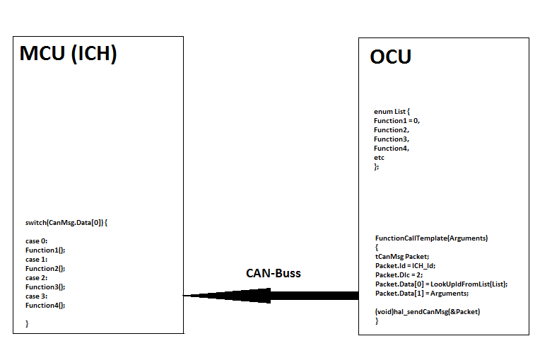

<!-- Table of contents ovan -->
\newpage

#Förslag för implementationslösning

Följande är idéer om hur vi ska gå tillväga för att implementera 
optionshanteringen både på nuvarande MCU och nya OCU.

##Inledning

I snabba drag så behöver MCU paketera och skicka signaler i realtid till OCU
för att ge underlag för dess beslutstagande. OCU behöver kommunicera
med MCU genom att tillkalla ett antal funktionsprimitiver som tillgängliggörs 
från MCU. Samtliga signaler och funktionsprimitiver har redan identifierats i
dokumentet _Primitives_. Följande är en specifikation över hur 
kommunikationsflödet kan struktureras.

##Funktionsprimitiver

När samtliga aktiva optioner körs på OCU förekommer funktionsanrop som berör MCU.
I tidigare implementation fanns funktionerna tillgängliga globalt eftersom 
optionshanteringen var inbyggd i standardmjukvaran.
Exempel på en sådan funktion i en optionsrutin:

`setMaxOptionSpeedHiRangeKmph(OptSpeed)` kallas globalt i ursprungliga 
optionshanteringen.

Med definitionen:
```c
void setMaxOptionSpeedHiRangeKmph(UByte SpeedKmph)
{
    // Only set restriction if it is lower than the set (this option can be used more than once)
    if (SpeedKmph < OptionSpeedHiRangeKmph) {
        OptionSpeedHiRangeKmph = SpeedKmph;
    }
}
```


\newpage


Med nya optionshanteringen behöver funktionerna tillkallas genom CAN-bussen. 
Planen är att på MCU sidan av CAN-bussen identifiera funktionsprimitiverna som
är nödvändiga med ett _Id-nummer_ för att simpelt kunna ta emot funktionsanrop
från OCU. Detta görs enkelt genom att implementera en lista som mappar 
funktionerna mot en siffra, för enkelhetens skull en byte. Bara funktioner som 
berörs av optioner mappas in i listan. Listan finns tillgänglig på både OCU och
MCU för att kommunikationen ska stämma överens. Listan kan enkelt kontrolleras
vid start av trucken med hjälp av checksumma för att klarlägga att listan är 
universell på både OCU och MCU.

Förutsatt att listan är etablerad kan vi använda existerande optioner rakt av
på OCU genom att implementera template funktioner för varje funktionsprimitiv 
som istället för att utföra funktionsunika instruktionerna enbart lägger till
en CAN Tx entry i CAN-bufferten med MCU adressen samt rätt _Id-nummer_ från 
listan tillsammans med argumenten för funktionen.
Fördelen är att optionsrutinerna inte behöver modifieras och kommer se identiska 
ut vilket kan underlätta för läsare som är inblandade i mjukvaran. Exempel på
template av funktionen i föregående exempel:

```c
void setMaxOptionSpeedHiRangeKmph(UByte SpeedKmph)
{
    tCanMsg OptionFunctionPacket;
    
    OptionFunctionPacket.Id = AdressToMCU;  // adress to MCU (ICH)
    OptionFunctionPacket.Dlc = 2;           // 2 byte
    
    // The Id-number corresponding to this function
    OptionFunctionPacket.Data[0] = IdList[setMaxOptionSpeedHiRangeKmph]; 
    OptionFunctionPacket.Data[1] = SpeedKmph; 
    
    (void)hal_sendCanMsg(&OptionFunctionPacket);
}
```

\newpage

MCU behöver kunna ta emot funktionerna och tillkalla dem för att den abstrakta 
kommunikationen ska vara komplett. En enkel lösning är att implementera en switch
på _Id-numret_ som tas emot och kalla funktionen globalt tillsammans med argumenten.

Beskrivande bild av den fullständiga kommunikationen:



##Realtidssignaler
TBA

##CANReceive
Högnivå funktionaliteten för att ta emot data från CAN-bussen måste implementeras
på MCU. Ursprungliga mjukvaran har två rutiner för att lasa inkommande medelande 
från CAN-bussen, om vi använder den strukturen på våra receive-rutiner får vi följande:
```c
void receiveOcuSdo(tOcuCan *Can);
void sortOcuSdo(const UByte *ReceivedData);
```
I funktionen `receiveOcuSdo()` kontrolleras ingående bufferten efter nyinkomna 
CAN-medelande adresserade till ICH. När ett medelande har identifierats kallas
`sortOcuSdo()` för att placera medelandets innehål på rätt sätt. 
Ex. om ett funktionsanrop kommer till ICH från OCU identifieras rätt funktion 
med hjälp av listan över funktioner sedan körs funktionen direkt.

Nämnda rutiner körs var 20ms precis som andra system, dock altid i preAplication
för att säkerställa att allt sker i rätt ordning tex.
ta emot data -> köra optioner -> skicka ny data.

Det finns mer hårdvarunära rutiner för att hantera mottagandet av CAN-meddelande.
I kernel hanteras avbrottsrutiner för att ta emot CAN-meddelande och detta sker 
med betydligt högre frekvens.

#Programloop
Beskrivning över respektive enhets huvudprogramloop.

##MCU
Huvudprogramloopen i MCUn påbörjas genom en initiering. Den faktiska 
programloopen, som vi också kallar huvudprogramloop, ser faktiskt bara ut som 
följande:

```c
while (1) {
    ;
}
```

MCU utför arbete genom interrupts. Ett interrupt kommer en gång var 1,25:e ms.
```c
interrupt void isrKernelTimer(void)
{
    INTR_FLAG = 0;          // Clear interrupt flag
    TIMER_6 = TIMEBASE_125; // Reload timer value
    
    runKernel();
}
```

I `runKernel()` händer väldigt mycket intressanta saker. Diverse felhantering
existerar genom att längden på ett kernel-tick mäts, för att säkerställa att
inget går fel. 

Vidare skickas CAN-meddelanden i prioritetsordning. Teoretisk maxhastighet på
CAN-bussen, med vald hastighet, är ett CAN-meddelande per ms. Företaget har valt
att skicka ett meddelande per interrupt, det vill säga en gång varje 1,25:e ms.

Vidare sker uppdatering av display samt avläsning av gasreglage omlott varje
interrupt.

Var 20:e ms körs programloopen där knapptryckningar, sensorer, diverse timers och
annat avläses och/eller återställs. Det är också här optionerna körs.

#Modifering av programloop
Programloopen som anropas från `runKernel()` och som körs från `app.c` heter
`runApplication()`. Här beskriver vi hur vi tänker modifera denna för att anpassa
till vår optionslösning.

Programloopen är uppdelad i olika tillstånd som trucken kan befinna sig i. Det
kan handla om huruvida användaren är inloggad, trucken laddas, trucken servas
eller annat. I några av dessa tillstånd kommer vi gå in och anpassa kod.

##Grundläggande struktur då trucken körs
Det ska finnas en rutin som läser av in-/utgångar, vilket innefattar knappar,
men även externa enheters in-/utgångar. Detta tillsammans med nuvarande hastighet
och andra liknande nuvärden läggs i kö för att skickas till OCU. Efter att värden
lagts in i CAN-busskön^[Meddelanden skickas vid interrupt och är ingenting vi
behöver tänka på] läser vi av inkomna CAN-meddelanden efter instruktioner som
skickats från OCU. Dessa behandlas och programloopen påbörjar ett nytt varv.

##Hantering av olika tillstånd (states)


##Lösa trådar

 - Hur ska den universella listan designas? En fil som inkluderas på både OCU och MCU? räcker Enum datastruktur?
 - är alla argument UByte?
 - Jag har utelämnat System, function osv vid identifikationen. bör inkluderas i identifikations systemet. 

