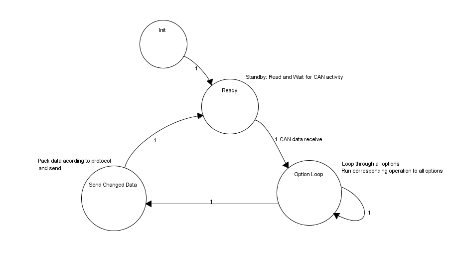

\newpage


\vspace*{6\baselineskip}


| Förkortning | Betydelse                                                       |
|-------------|-----------------------------------------------------------------|
| MCU         | Huvudstyrenhet                                                  |
| Spider      | Extern (från MCU) enhet där optionshantering ska implementeras  |


\newpage


#State machine

##Spider
Funktionaliteten från `optionfunc.c` flyttas mer eller mindre komplett till nya 
enheten. När Trigger Event[^1] sker ska hela optionsloopen utföra alla optionsunika 
instruktioner. Ändringen kommer då automatiskt appliceras på rätt sätt när 
processerna körs. 



[^1]: Avser knapptryckning/ändring i hastighet, eller liknande.


\newpage

#Utgångspunkt
Vi utgår från att parametrar så som hastighet, batterispänning, etc hela tiden
kommuniceras över CAN-bus. Spider lyssnar på CAN-bussen och läser det som är
relevant för optioner.

Parametrar uppdateras en gång var 20:e ms. Detta innebär också att det endast är
meningsfullt att köra optionsloopen en gång per 20 ms.

MCU kommer i sin huvudloop att lyssna på parameterändringar och funktionsanrop
från Spidern.

#Metodförslag
Internlagring av optioner planeras ske objektorienterat för att uppnå en organiserad
struktur. Objektorienteringen underlättar även vid vidareutveckling eftersom 
nya objektmedlemmar lätt kan läggas till och objektstrukturen då kan utökas.

Förslag på `Options`-objekt, som kommer finnas representerad
i en `array` på Spiderenheten:

```c
typedef struct {
    bool (*run)(void); // Function pointer to the option logic
    bool changed;      // Tells the system that the run function have changed
                       // some data
    
    // More if needed
} Option;
```

Huvudprogrammet kommer bestå av en simpel loop:

```c
void loop()
{
    // Interrupt driven(?)
    waitForAndReadCANdata();

    struct option opt; // Options settings storage
    for (var i = 0; i < size(optionsArray); ++i)
    {
        opt = optionsArray[i];

        //Option function pointer
        (*opt->run)();
    }
}
```

I funktionen `(*opt->run)()` finns logiken för varje option lagrad.
`CAN_data` är ett lokalt register (på Spider-enheten) som innehåller senaste
värdena som skickats över CAN-bussen. `run` utgår från dessa när den räknar
på optionsvillkoren.

Exempel på hur en `run`-funktion kan se ut:

```c
void run(void)
{
    // Shooting from the hip with parameter name
    if (CAN_data.TRUCK_SPEED_FORK_DIRECTION > 60 && CAN_data.BUTTON_6 == LOW)
    {
        // Truck speed is > 60 and there is no override. Disable high lift.
        CAN.setParam(PAR_DISABLE_LIFT_ABOVE_SWITCH, 1);
    }
    else
    {
        // Truck speed is > 60 and there is no override. Disable high lift.
        CAN.setParam(PAR_DISABLE_LIFT_ABOVE_SWITCH, 0);
    }
}
```

`CAN.setParam()` håller reda på vilka attribut som har ändrats och skickar 
därför endast parametrar som faktiskt har justerats. Detta genom att 
`CAN.setParam()` endast populerar en lista med ändrade parametrar.

Detta innebär att program-loopen kommer bli något liknande:

```c
void loop()
{
    waitForAndReadCANdata();

    struct option opt;
    for (var i = 0; i < size(optionsArray); ++i)
    {
        opt = optionsArray[i];
        opt.changed = false;
        
        // Option is a function pointer
        opt.changed = (*opt->run)();
    }

    // Here is where all the changed parameters actually is sent
    CAN.setChangedParams();
}
```

#Datatyper
Alla parametervärden är heltal - detta gör det smidigt att skicka nya värden
eftersom förväntad datatyp är känd på förhand.

I det fall andra inställningar ska gå att skicka krävs det en generell datatyp.

#Optionsinterface
För att anropa enkla funktioner på MCU krävs följande.

MCU måste tillgängliggöra funktioner över CAN-bussen. För detta krävs ett nytt
`API` där funktioner delas upp i _system_, _funktioner_ och _moduler_. En _modul_
är sista nivån i hierarkin. Till en _modul_ kan ett _value_ skickas.

`system` finns för att kunna låta `function` ha samma `int`-värden som det
`enum`-namn (implicit) konverteras till. Exempelvis är
`PAR_DISABLE_LIFT_ABOVE_SWITCH` ett `enum`-namn som motsvarar ett heltal (`int`).
Genom att sätta `system` till `PAR_MODIFICATION` kan vi skicka
`PAR_DISABLE_LIFT_ABOVE_SWITCH` utan att behöva tänka på att det `enum`-namnets
värde krockar med något annat `enum`-namns värde.

Denna data måste kunna skickas effektivt över CAN-bussen - absolut på <= 8 bytes.

Förslag på en möjlig `struct`:
```c
struct OptionPacket {
    UByte system,       // The truck will be divided into systems
    UByte function,     // Each system will consist of several functions.
                        // Param-index if param
    UByte module,       // Functions may have a module. Param-type if param

    enum {              // The value sent to a module must be of a type
      tUndefined,
      tSWord,
      tUByte,
      tBool
    } type;

    union               // The value sent to the module
    {
        UByte i;        // Maps to char (one byte)
        SWord u;        // Maps to long (two bytes)
        bool b;
    } value;
}
```

##Hantering av detta på MCU
Hantering av inkommande funktionsanrop from Spider.

Vi reder ut vilket system vi försöker nå:
```c
struct OptionPacket optionRequest;

while ((optionRequest = CAN.getNextOptionRequest()) != null) {
    switch(optionRequest.system) {
        case PAR_MODIFICATION_DRIVER: // Special handling for parameter modification
            handle_parDriver(optionRequest);
            break;
        case PAR_MODIFICATION_SERVICE_GENERAL: // Divided according as in Jura309
                                               // firmware configuration.xls
            handle_parServiceGeneral(optionRequest);
            break;
        case SYSTEM_1:
            handle_system1(optionRequest); //sub-system 1 function group
            break;
        case SYSTEM_2:
            handle_system2(optionRequest); //sub-system 2 function group
            break;
    }
}
```

För varje system tar vi reda på vilken funktion som ska anropas:
```c
void handle_system1(struct OptionPacket& optionRequest) {
    switch (optionRequest.function) {
        case FUNCTION_1:
            // Check if module is valid for this function
            if (optionRequest.type == tUByte) {
                function_1(optionRequest.b.value);
            }

            break;
        case ...:
            ...
    }
}
```

###Specialhanteringen av parametermodifiering
Parametrar kommer behöva lite specialbehandling, och i sin tur också delas in
i system. Detta eftesom det finns fler parametrerar än vad en `UByte` kan 
representera. Dessa delas in enligt _Jura309 Jura Firmware Configuration.xls_ 
```c
SWord parDriver(struct OptionPacket& optionRequest) {
    return setPar(optionRequest.function + offset, // Index + offset to 
                                                   // compensate max(UByte) = 255
                  optionRequest.module,            // ParameterType
                  optionRequest.value);            // ParameterValue
}
```
Returnerar `PARAM_UNDEFINED` om parametermodiferingen är ogiltig.


#Frågor
Frågor som har dykt upp.

 - Vilka saker ska kunna justeras av en option? (parametermodifiering, aktivera in-/utgångar)
 - Verktyg för state machine (verktyg för att rita bild)
 - Kan MCU skicka _trigger events_ till optionshanteraren (Spider) tex vid knapptryckning?
   Vad händer vid tex hastighetsinducerande trigger events?
 - Om inte ovan, får 60 ms[^2] fördröjning (maximal) antas, är detta OK?
   Finns det tidskritiska funktioner? (< 60 ms)
 - SDO eller PDO CAN?
 - `xtra.c` rutiner för att extrahera information från CAN-bussen; återanvända men utöka eller göra ny?
 - Göra en testbänk för CAN-bussen
 - Varför finns det 2 SEU?
 - ACT, ICH - vad står förkortningarna för?

[^2]: En omgång data kan precis ha skickats när en knapp tryck ned. Det tar då
      ~20 ms för nästa omgång data att skickas, och sedan 20 ms innan svar från
      Spider anländer. Totalt ~60 ms (worst case).
