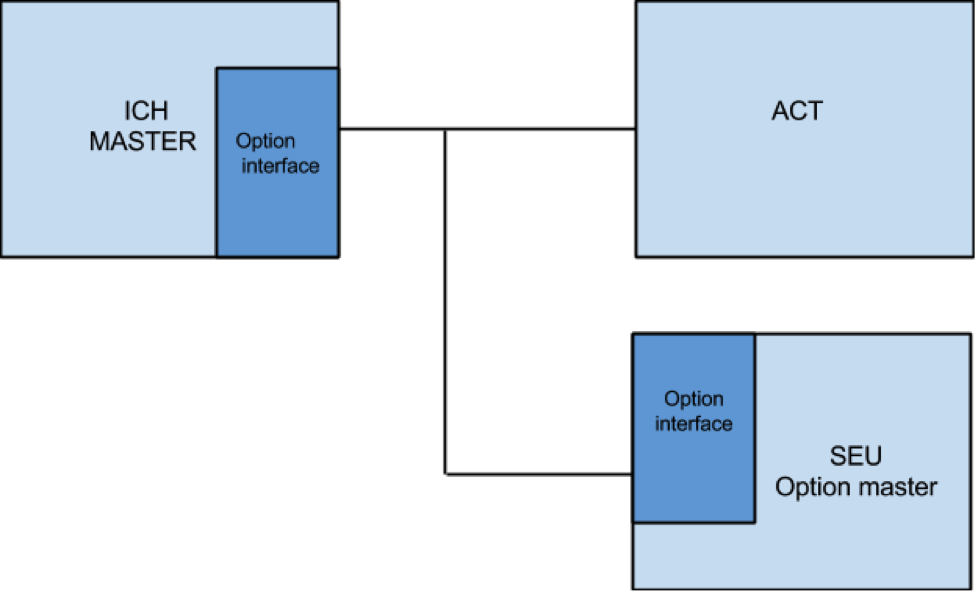

\newpage

#Revisions

| Version | Date       | Sign off      | Change note                           |
|---------|------------|---------------|---------------------------------------|
| 1.0     | 2015-02-17 | Robin, Niklas | First revision                        |

\newpage

#Plannig

##Authors
Niklas Blomqvist, CS  
Robin Gustafsson, CS

##Preliminary title
Options handling

##Problem
Today, BT Products handles a big quantity of customer specific options
on their fork lifts. The options are all being built in into the main controller
(MCU) of the truck. This leads to problems:

 * Developing the options requires a lot of resources, this because it began as 
   a "one-off job".
 * Because all of the features exists in the main firmware, the code becomes
   very complex and hard to follow. Many of the features are also inactivated 
   for most of the customers.
 * The available code memory will soon be filled. Adding additional code will 
   require a larger on chip memory.

BT Products is looking for an options handling sollution which allows the 
functionality to be moved from the MCU to a separate controller.

We will work out a solution where the options handling will allow development of
functionality, independ of the main firmware, in a more modular fasion. This 
will allow parameter based configuration without the need of rewriting code. It
is important that all existing options is handled properly. This will imply 
a reduction in time needed to develop new features.

A graphical interface is desired in order to simplify the administration of 
options without the need of deep programming knowledge. A _PLC representation_
would give the user a good overview of active options and also the possibility
to customize parameters. It is also important that the options handling is 
secure in a way that ensures that no unauthorized may tamper with it.

The long term goal is to incorporate the possibility to customize into  the 
standard software. There is no significant market value in the options 
handling it self, but in the long term there will be. Both in time savings as 
well as in product quality. This will give BT Products a better foundation to
decide on the possibility to include this in the control units of the trucks.

##Methods
Together with our mentor at BT, we will go through the existing documentation
and software in order to invent a new model. We need to conduct a detailed 
analysis of how the current options are handled. We will also investigate the 
system architecture, especially the CAN protocol. When all the requirements and
and details has been worked out, we may start the development of a prototype.
This work will be documented thoroughly.

##Delimitations
The time will not be sufficient to develop a full scale version of the options
handling. With respect to that, we have chosen to spend most of the time 
developing a working architecture, and a prototype. The prototype will be
written with flexibility in mind. This meaning it will be written in such way
that it should be easy to extend it with new features such as a graphical 
interface. From a testing perspective, this is the natural way to go.

The fundamental part of this thesis is the development of an architecture 
as general as possible. It is therefore not vital that we implement all the 
existing options, as long as the architecture can be deemed good enough to 
handle them.

Further, one possible delimitation might be to hand off the MCU side of the
development to BT. This option, however, depends on how much time BT can spare.
This delimiation is only applicable if we decide to put the options handling in
an external chip. In this case, all of the options currently existing shall be
implemented.

The communication between the MCU and the indented extra unit will occur over
the CAN bus. This means that the protocol must be implemented in the prototype.
The results will be validated with the help of a HIL (Hardware In the Loop) 
system and/or with a truck.

##Existing documentation

 - Data sheet of the CAN-bus protocol
 - http://www.ti.com/lit/an/sloa101a/sloa101a.pdf
 - Literature on model based development

This list will be updated during week one.

\newpage

##Time planning
Each week will begin with a meeting to get answers on questions we've gathered
over the weekend and also make sure we keep up with the planning.

###Week 0 (February 16th to 20th)
Complete the detailed planning and obtain clearance from the examiner.

###Week 1 to week 2
Begin at BT.
Learn about the current system. This means reading documentation and read 
program code. In parallel we will find applicable literature, which we will do
throughout all stages.

###Week 2
Investigate possible architectures.

###Week 3
Produce a specification and get it controlled by our mentor at BT.
Finish the model. It might change if we detect flaws.

###Week 4 to 7
Develop a prototype.

###Week 7
Milestone: In front of a _larger_ crowd demonstrade our prototype so far.

###Week 8 to 9
Continue with the prototype.

###Week 9
The prototype should now be finished and ready for a final demonstration.

###Week 10
Presentation the people on BT where we talk about what we have done and what
we have learned.

