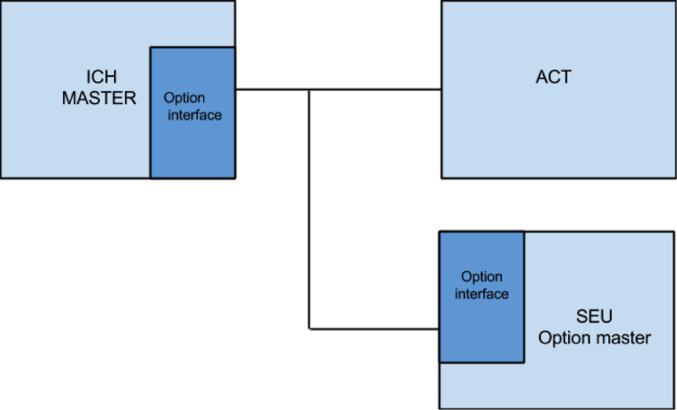

\newpage

#Historik

| Version | Datum      | Ansvarig      | Ändring                               |
|---------|------------|---------------|---------------------------------------|
| 1.0     | 2015-02-17 | Robin, Niklas | En mer detaljerad plan ämnad för      |
|         |            |               | examensarbeteskoordinator Ahmed       |
|         |            |               | Rezine. Även början på första utkast  |
|         |            |               | av planeringsrapport.                 |

\newpage

#Planering

##Författare
Niklas Blomqvist, Di
Robin Gustafsson, Di

##Preliminär titel
Optionshantering

##Problemformulering
BT Products hanterar idag en stor mängd kundspecifika anpassningar på sina
truckar. Dessa byggs i nuläget in i truckens huvudstyrenhet (MCU) vilket leder
till problem.

 * Utveckling av specialmjukvaran på nuvarande optionshantering är väldigt
   resurskrävade eftersom att det ursprungligen ansågs som "engångsjobb"
 * Onödig komplexitet tillförs eftersom alla unika specialfunktioner alltid
   finns närvarande men merparten är inaktiverade. Det medför även svårläst
   programkod och ökad risk för att buggar förekommer.
 * Kodminnet närmar sig sitt tak.

BT Products efterlyser en optionshanteringslösning som tillåter att
funktionaliteten flyttas från MCUn till en separat enhet.

Den optionshanteringslösning vi ska arbeta fram ska tillåta att funktionalitet
utvecklas oberoende grundmjukvaran på ett mer modulärt sätt.
Man kan då anpassa mjukvaran parameterbaserat utan att behöva skriva om
programkoden. Det är viktigt att alla ordinarie och nuvarande optioner hanteras
på rätt sätt. Optionhanteraren ska vara expanderbar vid utveckling av nya
optioner. Detta ska implicera förkortad utvecklingstid och hjälpa till att
undvika problem.

Ett grafiskt användargränssnitt är önskvärt för att simplifiera administration
av optioner utan att behöva djup kunskap. En PLC-representation av den
parameterbaserade optionshanteringen ger en simpel nog överblick över aktiva
optioner och möjligheten att anpassa parametrar. Det är även viktigt att
optionshanteringen sker på ett ansvarfullt sätt så att man kan säkerställa att
ingen obehörig manipulation är möjlig.

Det lågsiktiga målet är att mjukvaran för dessa specialanpassningar en dag ska
ingå i standardmjukvaran. Det är inget direkt marknadsvärde i optionshanteringen
men potentiella besparningar i längden och ökar produktkvalitet överlag.
Efter arbetets process ska BT Products ha en bättre inblick i
inkluderingsmöjligheterna av en sådan optionshantering i truckarnas styrsystem.

##Angreppssätt
Tillsammans med handledaren på BT kommer vi genom befintlig dokumentation och
mjukvara ta fram en modell för den nya optionshanteringsenhetens design och
funktion. Vi behöver utföra en detaljerad analys över hur nuvarande optioner
hanteras så att vi kan bevara dessa i sin helhet. Vi kommer även undersöka
systemarkitekturen, speciellt CAN-protokollet, för att utforska
inkluderingsalternativen för den nya enheten. När alla krav och detaljer är
specificerade för enhetsmodellen kan vi påbörja utvecklingsprocessen.
All högnivåmodellering kommer att dokumenteras väl.

##Avgränsningar
Tiden kommer inte räcka till en fullständig utveckling av
optionshanteringsenheten.
Vi har, med hänsyn till det, valt att begränsa och tillägna större delen av
arbetet att ta fram en fungerande arkitektur samt prototyp. När prototypen
utvecklas ska det finnas i åtanke att det i framtiden är önskvärt att ha
möjligheten att kunna lägga på ett grafiskt användargränssnitt.
Ur testperspektiv är detta en naturlig väg att gå.

Den fundamentala delen av projektarbetet är utvecklingen av en arkitektur
som är så generell som möjligt. Implementering av alla existerande optioner
kan därför förbises, så länge arkitekturen kan anses vara kapabel att behandla
dessa. Ytterligare en eventuell (OBS!) avgränsning är att BT hanterar
utecklingen för MCU medan vi begränsar oss till optionshanteringen.
Denna avgränsning appliceras i det fall optionshanteringen blir extern.
I prototypen ska ordinarie optioner vara bevarade och fullt fungerande.
Kommunikationen mellan MCU och den tänkta tilläggsenheten för optionshantering
ska ske över den befintliga CAN-bussen och därför ska kommunikationprotokollen
vara etablerade även för prototypen. Resultatet planeras därefter valideras med
hjälp av antingen ett HIL (Hardware In the Loop) system som andvänds av BT eller
applicering på en truck.

##Befintlig dokumentation

 - Datablad CAN-bus protokoll
 - http://www.ti.com/lit/an/sloa101a/sloa101a.pdf
 - Literatur för modellbaserad utvecklingsmetodik

Kommer fyllas på mer under vecka 1

\newpage

##Tidsplanering
Varje vecka kommer att påbörjas med ett möte för att få eventuella frågor
besvarade samt få en överblick över hur vi ligger till tidsmässigt.

###Vecka 0 (16 - 20 Februari)
Färdigställa detaljplan och problemformulering samt erhålla klartecken från
examinatorn.

###Vecka 1 - vecka 2
Påbörja arbetet på BT.
Lära oss hur nuvarande system fungerar, vilket innebär inläsning av
dokumentation samt gå igenom programkod. Parallellt med detta ska lämplig
litteratur tas fram, något som också kommer att ske fortlöpande genom arbetets
gång.

###Vecka 2
Utreda möjliga arkitekturlösningar.

###Vecka 3
Ta fram en kravspecifikation för modellen och CAN-protokoll och stämma av med
handledare. Modell klar (småändringar kan komma att ske under arbetets gång om
vi märker att något blir tveksamt).

###Vecka 4-7
Arbetet med att ta fram en prototyp.

###Vecka 7
Målstolpe: för en större grupp redovisa den prototyp vi hittils har utvecklat
för att erhålla feedback.

###Vecka 8-9
Fortsatt arbete med prototyp.

###Vecka 9
Prototypen bör vara färdigställd och redo för slutdemonstration.

###Vecka 10
För personalen på BT framläggning av genomfört arbete samt lärdomar.